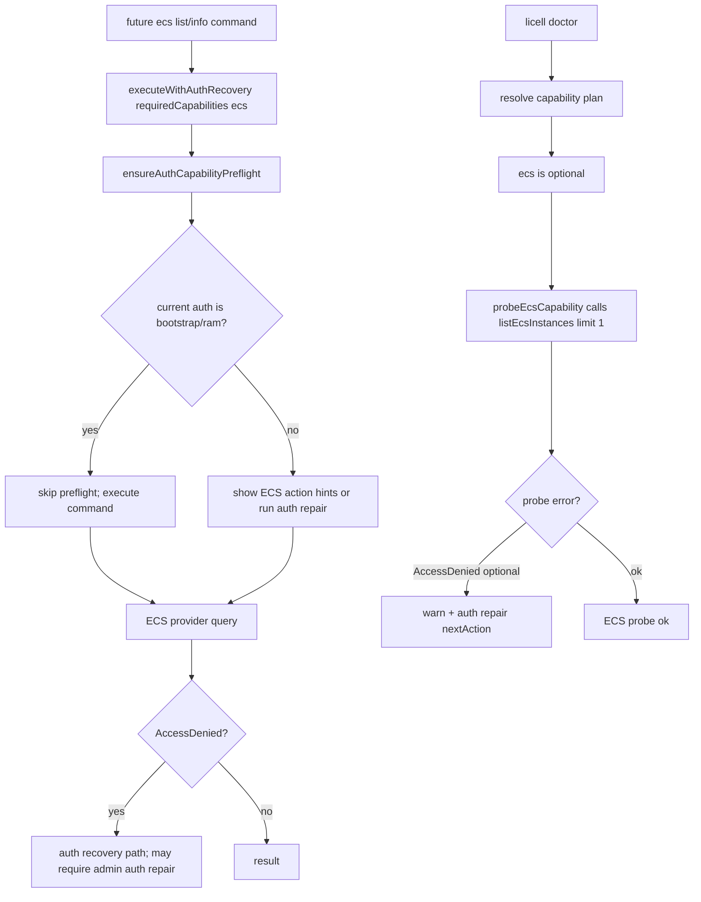

# ecs-auth-read-permissions feature design

## 0. 术语约定

| 术语 | 定义 | 防冲突结论 |
|---|---|---|
| `AuthCapability` | Licell 命令声明所需云服务能力的 TypeScript union，供 `executeWithAuthRecovery()` 和授权修复提示使用。 | 当前在 `src/utils/auth-recovery.ts`，没有 `ecs`；本 feature 新增的 `ecs` 只代表 ECS 只读查询能力。 |
| capability action hints | `resolveAuthCapabilityActions()` 根据 capability 返回的 RAM action 提示。 | 这是提示和测试 seam，不是最终 policy 唯一来源；最终 bootstrap/repair 仍依赖 `LICELL_POLICY_ACTIONS`。 |
| `LICELL_POLICY_ACTIONS` | bootstrap / repair 写入自定义 RAM policy 的 action 列表。 | 当前 ECS 只覆盖安全组 `DescribeSecurityGroups` / `CreateSecurityGroup`；本 feature 只补 ECS 查询 Describe action。 |
| doctor capability probe | `licell doctor` 对云服务读权限和 region endpoint 的诊断探测。 | 当前 doctor 对 required + optional capability 全部执行 probe；加入 ECS 后会成为全员 optional 探测。 |
| bootstrap operator | 由 Licell bootstrap 创建的 RAM 用户和 AK/SK。 | `ensureAuthCapabilityPreflight()` 对 bootstrap 凭证短路，存量 operator 必须由管理员重新 `licell auth repair` 才能获得新增 ECS Describe 权限。 |

## 1. 决策与约束

### 需求摘要

本 feature 只交付 ECS 只读授权能力的公共契约，为后续 `licell ecs list/info` 消费：

- 新增 `AuthCapability = 'ecs'`，补齐 `AUTH_CAPABILITY_LABELS.ecs` 与 `resolveAuthCapabilityActions(['ecs'])`。
- 把 `ecs:DescribeInstances`、`ecs:DescribeInstanceAttribute` 加入 bootstrap / repair 使用的 `LICELL_POLICY_ACTIONS`。
- 在 `licell doctor` 的 capability probe 中加入 ECS optional 探测，使用 provider 合同里的 `listEcsInstances({ limit: 1 })`。
- 用测试锁定 label、action hints、RAM policy、doctor plan/probe 和 optional AccessDenied warn 行为。

明确不做：

- 不注册 `licell ecs` 命令，不修改 command registry、help、catalog、README 或 agent surface。
- 不实现 ECS provider 查询逻辑；该能力来自前置 `ecs-readonly-provider` 合同。
- 不新增 ECS 生命周期或创建类权限；不得加入 `ecs:StartInstance`、`ecs:StopInstance`、`ecs:RebootInstance`、`ecs:DeleteInstance`、`ecs:RunInstances` 等 mutating action。
- 不把 ECS 设为 deploy / static / task 工作流 required capability；本 feature 只接受 ECS 进入 doctor optional 探测。
- 不改变 `ensureAuthCapabilityPreflight()` 对 bootstrap 凭证的短路规则；存量 operator 的迁移路径是管理员重新执行 `licell auth repair`。

### 复杂度档位

走云权限与诊断默认档位：`Robustness=L3`、`Structure=modules`、`Performance=reasonable`、`Readability=team`、`Testability=tested`、`Security=validated`。

偏离点：

- `Security=validated`：新增默认 RAM action 是权限边界变化，必须用负向检查证明没有提前加入 mutating ECS action。
- `Performance=reasonable`：doctor 每次多一次 `limit=1` ECS 只读云调用，不设额外性能预算，但必须保持 optional warn 不阻断。

### 关键决策

1. **ECS capability 只表示只读实例查询**  
   `CAPABILITY_ACTIONS.ecs` 固定为 `ecs:DescribeInstances` / `ecs:DescribeInstanceAttribute`。生命周期操控权限必须等后续 mutating feature 按命令和 safety 重新审查。

2. **bootstrap policy 是存量 operator 的真实落点**  
   capability action hints 只影响 preflight 提示；bootstrap 凭证会在 `ensureAuthCapabilityPreflight()` 中短路。因此新增 ECS 查询权限必须进入 `LICELL_POLICY_ACTIONS`，并通过 RAM policy 测试覆盖。

3. **doctor ECS 探测是主动扩面，且保持 optional**  
   Roadmap 已确认接受全员 `licell doctor` 多一次 ECS read probe。实现应把 `ecs` 加入 `DOCTOR_CAPABILITY_ORDER`，建议插在 `vpc` 后、`cr` 前，使 network / compute / container 顺序稳定；当前 resolver 不把 ECS 加入 required set。

4. **doctor probe 复用 provider seam，不直接新写 ECS SDK 调用**  
   ECS provider 是 SDK endpoint、分页和过滤的唯一查询 seam。doctor 只调用 `listEcsInstances({ limit: 1 })`，避免在诊断模块里复制 ECS client 构造或 request shape。

5. **存量 bootstrap operator 的迁移提示是产品行为，不是自动 self-repair**  
   旧 operator 没有新 Describe action 时，doctor optional probe 应显示 ECS 权限 warn，并给出 `licell auth repair` next action。由于 operator 自身通常没有 RAM 写权限，不承诺自动修复成功。

### Top 3 风险与缓解

| 风险 | 缓解 |
|---|---|
| 新增 union 后 label/action/probe 任一处遗漏，导致 help 或 doctor 出现 undefined / type drift。 | `Record<AuthCapability, ...>` 只保证 key 存在；value 内容必须由显式单测断言 `AUTH_CAPABILITY_LABELS.ecs`、`resolveAuthCapabilityActions(['ecs'])`、RAM policy 和 doctor probe 行为。 |
| 默认 RAM policy 权限过宽，提前给 lifecycle 操作开门。 | RAM policy 测试必须断言新增 Describe action 存在，同时断言 `Start/Stop/Reboot/Delete/RunInstances` 不存在。 |
| doctor ECS optional probe 对旧 operator 产生 warn，被实现误当成 failure 或试图隐藏。 | doctor 测试覆盖 `ecs` 在 plan.optional，AccessDenied 归为 warn，summary / nextActions 指向 `auth repair`。 |

### 非显然依赖与关键假设

- 本 feature 的实现依赖 `ecs-readonly-provider` 先提供 `listEcsInstances({ limit })` public surface；当前阶段只消费该 design 合同，代码实现必须按 roadmap 依赖顺序执行。
- 当前仓库可能没有 `node_modules`；实现前必须恢复依赖，`bun run typecheck` 是 core / fix-or-block。
- `AUTH_CAPABILITY_LABELS` 与 `CAPABILITY_ACTIONS` 是 `Record<AuthCapability, ...>`，新增 union 会让 typecheck 强制补键；`DOCTOR_CAPABILITY_ORDER` 是普通数组，加入 `ecs` 是本 feature 的显式产品选择。
- 存量 bootstrap operator 升级后不会自动获得新 RAM action；管理员需要用有 RAM 权限的凭证执行 `licell auth repair`。

### 必跑验证命令

- `bun run typecheck`
- `bun x vitest run src/__tests__/auth-recovery.test.ts src/__tests__/ram-bootstrap.test.ts src/__tests__/doctor-cloud.test.ts`
- `bun x vitest run src/__tests__/doctor-cloud-integration.test.ts`
- `python3 .codestable/tools/validate-yaml.py --file .codestable/features/2026-07-03-ecs-auth-read-permissions/ecs-auth-read-permissions-checklist.yaml --yaml-only`

### 交付物与清洁度

交付物类别：

- Auth capability 合同更新。
- Bootstrap / repair RAM policy action 更新。
- Doctor ECS optional probe 与诊断测试。
- 本 feature 的 review、QA、acceptance 报告。

清洁度规则：

- 不新增临时 `console.log`、TODO/FIXME、注释掉代码或未使用 import。
- 不把 mutating ECS action 加入 capability hints 或 default policy。
- 不在 doctor probe 中写项目状态或调用 mutating ECS API。
- 不在本 feature 修改 command/docs/generated surface。

## 2. 名词与编排

### 2.1 名词层

#### 现状

- `src/utils/auth-recovery.ts:10` 的 `AuthCapability` union 还没有 `ecs`。
- `src/utils/auth-recovery.ts:12-23` 的 `AUTH_CAPABILITY_LABELS` 与 `src/utils/auth-recovery.ts:25-54` 的 `CAPABILITY_ACTIONS` 是 `Record<AuthCapability, ...>`；新增 union 后 typecheck 会要求补键。
- `src/utils/auth-recovery.ts:107-110` 的 `resolveAuthCapabilityActions()` 是命令 preflight 和 RAM policy coverage test 使用的 action hint seam。
- `src/utils/auth-recovery.ts:305-307` 对 bootstrap / ramUser / ramPolicy 凭证直接跳过 capability preflight。
- `src/providers/ram.ts:122-124` 目前只有 ECS 安全组 action，没有 ECS 实例查询 action。
- `src/providers/doctor-cloud.ts:42` 的 `DOCTOR_CAPABILITY_ORDER` 不含 ECS；`src/providers/doctor-cloud.ts:1194-1220` 的 `CAPABILITY_PROBES` 是 capability 到 probe 的穷尽映射。
- `src/providers/doctor-cloud.ts:453-482` 从 `DOCTOR_CAPABILITY_ORDER` 推导 optional capability；`src/providers/doctor-cloud.ts:1659-1675` 对 required + optional 全部执行探测。

#### 变化

Auth capability 合同：

```ts
// 来源：src/utils/auth-recovery.ts
export type AuthCapability =
  | 'fc' | 'dns' | 'oss' | 'rds' | 'rdsai' | 'redis' | 'cdn' | 'vpc' | 'cr' | 'logs'
  | 'ecs';

AUTH_CAPABILITY_LABELS.ecs = 'ECS';

// CAPABILITY_ACTIONS 不需要新增 public export；测试通过 resolveAuthCapabilityActions(['ecs']) 观察。
CAPABILITY_ACTIONS.ecs = [
  'ecs:DescribeInstances',
  'ecs:DescribeInstanceAttribute'
];
```

RAM policy 合同：

```ts
// 来源：src/providers/ram.ts LICELL_POLICY_ACTIONS
// 现有 ECS security group action 保留：
'ecs:DescribeSecurityGroups',
'ecs:CreateSecurityGroup',

// 新增 ECS read-only instance query action：
'ecs:DescribeInstances',
'ecs:DescribeInstanceAttribute',
```

Doctor capability 合同：

```ts
// 来源：src/providers/doctor-cloud.ts
DOCTOR_CAPABILITY_ORDER includes 'ecs'; // 建议 vpc 后、cr 前

CAPABILITY_PROBES.ecs = async () => probeEcsCapability();

async function probeEcsCapability(): Promise<DoctorCloudCapabilityProbe> {
  await listEcsInstances({ limit: 1 });
  return {
    capability: 'ecs',
    label: AUTH_CAPABILITY_LABELS.ecs,
    required: false,
    status: 'ok',
    summary: 'ECS 读权限与 region endpoint 可用。',
    details: ['probe: DescribeInstances(limit=1)']
  };
}
```

测试 seam 约定：

```ts
// 来源：src/providers/doctor-cloud.ts
export async function runCapabilityProbe(
  auth: AuthConfig,
  capability: AuthCapability,
  required: boolean
): Promise<DoctorCloudCapabilityProbe>;
```

`runCapabilityProbe()` 是内部诊断 seam，用于 `src/__tests__/doctor-cloud.test.ts` 在 `vi.mock('../providers/ecs')` 后直接调用 `runCapabilityProbe(auth, 'ecs', false)`。这样可以在 core 单测里同时观察 `listEcsInstances({ limit: 1 })` 成功路径和 AccessDenied → optional warn 分类，而不需要通过 `runDoctorCloudDiagnostics()` 触发 STS/RAM/domain 等其它网络 probe。`probeEcsCapability()` 可继续保持模块内私有。

##### Interface 设计检查

- Module：`Auth & Safety` 横切模块，现有 `auth-recovery` / `ram` / `doctor-cloud` 三个内部 interface 同步扩展。
- Interface：caller 必须知道 `requiredCapabilities: ['ecs']` 会给出 ECS 查询 action hint，bootstrap / repair policy 会包含对应 Describe action，doctor 会把 ECS 作为 optional read probe 展示。
- Seam：命令层 seam 是 `executeWithAuthRecovery({ requiredCapabilities: ['ecs'] })`；RAM seam 是 `LICELL_POLICY_ACTIONS`；doctor runtime seam 是 `DOCTOR_CAPABILITY_ORDER` + `CAPABILITY_PROBES.ecs`，测试 seam 是 exported `runCapabilityProbe(auth, 'ecs', false)`。
- Depth / locality：权限 action 和 doctor 行为集中在三个共享表面；如果不加 capability，后续 `ecs list/info` 需要复制 RAM action 文案和权限提示。
- Dependency strategy：auth / RAM policy assembly 是 in-process；doctor ECS probe 经 provider seam 访问 true external ECS 服务。
- Adapter：不新增 adapter。doctor 测试通过 module mock `listEcsInstances()` 替代外部 ECS 调用。
- Test surface：`resolveAuthCapabilityActions()`、`buildLicellPolicyDocument()`、`resolveDoctorCapabilityPlan()`、`runCapabilityProbe()` 和 `summarizeDoctorCapabilityProbes()` 可观察全部核心场景；`runDoctorCloudDiagnostics()` 的集成测试可保持非核心 smoke，不承担 ECS probe 细节断言。

### 2.2 编排层

#### 主流程图



#### 现状

- 命令层已有 `requiredCapabilities` 模式，例如 `src/commands/db.ts` 用 `['rds']`，但 ECS 不能被类型系统接受。
- RAM bootstrap / repair 都从 `LICELL_POLICY_ACTIONS` 构建或合并 policy；存量 policy 的缺失检查也以这份列表为准。
- Doctor 的 capability resolver 只会把 FC/OSS/CR/VPC 根据项目形态设为 required，其余 order entries 成为 optional。

#### 变化

- 新增 `ecs` 后，后续 ECS 命令可以直接传 `requiredCapabilities: ['ecs']`，不需要局部绕过类型。
- bootstrap / repair 生成的新 policy 会包含 ECS Describe action；存量 policy 在管理员执行 repair 后通过 `ensureCustomPolicyWithActions()` 合并新 action。
- doctor 每次云端诊断都会探测 ECS optional 能力。ECS AccessDenied 通过现有 `classifyCloudError(required=false)` 归为 warn，最终能力汇总不应变成 error。

#### 流程级约束

- 顺序：实现必须先接入 capability 和 RAM policy，再接 doctor probe；否则 probe 可以存在但 bootstrap operator 仍拿不到权限。
- 错误语义：ECS optional probe 失败只能是 warn；除非后续 roadmap 明确把 ECS 变成某工作流 required capability。
- 幂等性：重复 `auth repair` 只合并缺失 action，不应重复创建无意义 policy；沿用现有 `ensureCustomPolicyWithActions()`。
- 可观测点：doctor details 应包含 ECS label、probe action、warn summary；auth repair next action 应继续出现。
- 扩展点：后续 lifecycle feature 必须新增自己的 mutating action 审查，不能复用本 feature 的只读 capability 自动扩大默认 policy。

### 2.3 挂载点清单

- `src/utils/auth-recovery.ts` 的 `AuthCapability` / `AUTH_CAPABILITY_LABELS` / capability action hints：新增 `ecs` 能力，后续命令由此声明权限需求。
- `src/providers/ram.ts` 的 `LICELL_POLICY_ACTIONS`：新增 ECS Describe action，bootstrap / repair policy 由此获得查询权限。
- `src/providers/doctor-cloud.ts` 的 `DOCTOR_CAPABILITY_ORDER` / `CAPABILITY_PROBES`：新增 ECS optional cloud probe，`licell doctor` 由此可见 ECS 读权限状态。

本 feature 不引入用户命令、配置 key、文档生成入口或项目状态字段。

### 2.4 推进策略

1. Capability contract：新增 `ecs` capability、label 和 action hints。  
   退出信号：`resolveAuthCapabilityActions(['ecs'])` 返回且仅返回 ECS 两个 Describe action，`AUTH_CAPABILITY_LABELS.ecs` 非空；`ram-bootstrap.test.ts` 的 capability coverage 数组必须包含 `ecs`，避免既有不变量漏测。
2. Bootstrap policy：把 ECS Describe action 加入默认 RAM policy。  
   退出信号：policy document 包含两个新增 Describe action、保留安全组 action；`ram-bootstrap.test.ts` 新增负向断言，确认不包含 `ecs:StartInstance`、`ecs:StopInstance`、`ecs:RebootInstance`、`ecs:DeleteInstance`、`ecs:RunInstances` 等 mutating action。
3. Doctor optional probe：把 ECS 加入 doctor capability order 与 probe。  
   退出信号：`doctor-cloud.test.ts` 断言任意当前 capability plan 下 `ecs` 都在 optional 且不在 required；mock `../providers/ecs` 后调用 exported `runCapabilityProbe(auth, 'ecs', false)`，可观察 `listEcsInstances({ limit: 1 })` 并返回 ok。
4. Migration / warn characterization：锁定旧 operator 场景的诊断行为。  
   退出信号：`doctor-cloud.test.ts` mock `listEcsInstances()` 抛 AccessDenied 后调用 `runCapabilityProbe(auth, 'ecs', false)`，返回 warn；再用 `summarizeDoctorCapabilityProbes()` 断言 nextActions 包含 `licell auth repair`，不会升级为 required error。
5. Validation cleanup：运行验证并确认 scope 没有漂移。  
   退出信号：typecheck、相关 vitest、checklist yaml 校验通过，diff 不包含 ECS 命令注册、generated docs 或 mutating ECS action。

### 2.5 结构健康度与微重构

`.codestable/compound/` 当前没有命中“目录 / 命名 / 归属 / composable / 组件”相关沉淀。

##### 评估

- 文件级 — `src/utils/auth-recovery.ts`：448 行，职责集中在登录/授权修复/capability hints。本 feature 只追加一个 capability key，不需要拆文件。
- 文件级 — `src/providers/ram.ts`：677 行，偏胖但 `LICELL_POLICY_ACTIONS` 是 bootstrap policy 的唯一事实源；本 feature 只追加 action，不改变 RAM workflow。
- 文件级 — `src/providers/doctor-cloud.ts`：1685 行，明显偏胖，混合 identity、RAM、deploy target、domain consistency 和 capability probes。本 feature 只加入一个 probe；拆分 doctor capability registry 会改变大量 import 和测试边界，超出“只搬不改行为”。
- 目录级 — `src/providers/`：顶层约 13 个文件，doctor / RAM / provider facade 已经同层存在；本 feature 不新增 provider 目录文件，目录摊平不扩大。
- 测试级 — `src/__tests__/auth-recovery.test.ts`、`ram-bootstrap.test.ts`、`doctor-cloud.test.ts`：现有测试文件职责与本 feature 的验证面匹配，追加 characterization 测试即可。

##### 结论：不做微重构

本 feature 是横切权限表面的小范围扩展。立即拆 `doctor-cloud.ts` 会把风险从权限合同转移到大规模重排，不符合当前 epic 的查询优先目标。

##### 超出范围的观察

- `src/providers/doctor-cloud.ts` 已经超过 1600 行。若后续继续新增多个 cloud capability probe，建议另起 `cs-refactor` 把 capability probe registry 和各产品 probe 拆出独立模块；本 feature 不动。

## 3. 验收契约

### 关键场景

- S1 capability action：输入 `resolveAuthCapabilityActions(['ecs'])`，期望返回 `ecs:DescribeInstanceAttribute` 与 `ecs:DescribeInstances`，无 mutating action。
- S2 label：读取 `AUTH_CAPABILITY_LABELS.ecs`，期望为稳定非空标签，doctor 和 preflight 不出现 undefined。
- S3 RAM policy：调用 `buildLicellPolicyDocument()`，期望 action 列表包含两个 ECS Describe action 和既有安全组 action，不包含 start/stop/reboot/delete/run/create instance。
- S4 doctor plan：在所有当前 `resolveDoctorCapabilityPlan()` 分支下，期望 `ecs` 恒出现在 `optional`，不出现在 `required`。
- S5 doctor probe success：在 `doctor-cloud.test.ts` 中 mock provider `listEcsInstances()` 成功，调用 exported `runCapabilityProbe(auth, 'ecs', false)`，期望 ECS probe 调用 `{ limit: 1 }` 并返回 ok。
- S6 doctor optional AccessDenied：在 `doctor-cloud.test.ts` 中 mock ECS probe AccessDenied，调用 `runCapabilityProbe(auth, 'ecs', false)`，期望 probe status 为 warn；再汇总后 nextActions 包含 `licell auth repair`，不把 doctor capabilities 变成 error。
- S7 migration notice：设计和测试证据明确存量 bootstrap operator 需要管理员重新 `licell auth repair`，不承诺 operator 自身自动修复。
- S8 scope guard：实现 diff 不包含 `src/commands/ecs.ts`、command registry/docs generated block，不包含 ECS mutating action。

### Acceptance Coverage Matrix

| 场景 | Checklist step | 证据类型 | 核心 |
|---|---|---|---|
| S1 / S2 capability action 与 label | Step 1 | unit test / typecheck | yes |
| S3 RAM policy 最小权限 | Step 2 | unit test / diff review | yes |
| S4 / S5 doctor optional probe | Step 3 | unit test / module mock | yes |
| S6 / S7 旧 operator warn 与 repair 引导 | Step 4 | unit test / review report | yes |
| S8 scope guard | Step 5 | diff review / validation output | yes |

### DoD Contract

| Gate | Contract |
|---|---|
| Design DoD | 本 design 和 checklist 通过独立 design-review；保持 draft，等待 epic 批量统一确认。 |
| Implementation DoD | capability、RAM policy、doctor probe 与测试全部实现；不改命令 surface，不加 mutating action。 |
| Review DoD | 独立 code review 重点检查权限边界、doctor optional warn、存量 operator migration 和 scope drift。 |
| QA DoD | 运行 typecheck、auth/RAM/doctor 相关 vitest，必要时补 doctor integration mock 验证。 |
| Acceptance DoD | 验收报告能从 diff、测试输出和 checklist checks 证明 ECS 查询权限已进入 auth/repair/doctor，但 lifecycle 权限未进入默认 policy。 |

Required artifacts：

- `ecs-auth-read-permissions-review.md`
- `ecs-auth-read-permissions-qa.md`
- `ecs-auth-read-permissions-acceptance.md`
- 相关测试命令输出

## 4. 与项目级架构文档的关系

本 feature 不新增公开架构文档或 ADR。它遵守 roadmap §4.3 的 Auth capability 与 RAM policy 契约，并把已确认的 doctor optional probe 取舍落实为 feature 级验收。

后续如果 ECS lifecycle feature 要扩大 RAM action 或改变 doctor required/optional 语义，应另起 feature design，并考虑用 `cs-domain` 记录 ECS 操控安全策略 ADR。
