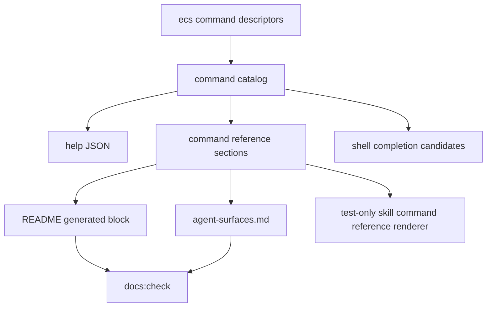

# ecs-command-surface-docs feature design

## 0. 术语约定

| 术语 | 定义 | 防冲突结论 |
|---|---|---|
| command surface | `catalog`、`--help --output json`、README 命令速查、agent-surface、test-only skill command reference renderer 和 shell completion 共同暴露的 CLI 面。 | 源头必须是 command registry / descriptor，不手工复制命令表。 |
| generated docs | README generated blocks、`docs/reference/agent-surfaces.md`、scenario generated sections。 | 通过 `bun run docs:sync` 写入，通过 `bun run docs:check` 防漂移。 |
| skill scaffold | `src/utils/skills-scaffold.ts` 生成的 `.claude/skills/licell/SKILL.md` / Codex skill 内容。 | 当前 repo-local skill 已存在；本 feature 只确保 scaffold 文案与 ECS 覆盖范围同步，并用测试守护。 |
| INFRA section order | 新增 `Cloud Infrastructure` section 在生成 surface 中位于 `Data Services` 与 `Automation & Tooling` 之间。 | 由 `LICELL_COMMAND_MANIFEST.modules` 首次出现顺序驱动，不由 section 常量自动排序。 |
| skill command reference renderer | `renderSkillCommandReference()` 生成的命令参考文本。 | 当前只被测试消费，不写入 `.claude/skills/licell/SKILL.md`；它可作为 registry surface 的 guard，不代表 agent-facing skill 含命令表。 |

## 1. 决策与约束

### 需求摘要

本 feature 不新增 ECS 查询行为，而是收口命令面和文档面：

- 确认 `ecs list` / `ecs info` 的 descriptor 已足够驱动 catalog、help JSON、README、agent surface、skill command reference 和 shell completion。
- 运行 `bun run docs:sync` 生成 README generated block 与 `docs/reference/agent-surfaces.md`，再用 `bun run docs:check` 证明无漂移。
- 让 repo-local / scaffolded `licell` skill 的描述覆盖 ECS 查询能力，但仍要求 Agent 以 `catalog` / `help` 为事实源。
- 验证 `Cloud Infrastructure` section 在 command reference / catalog / docs 中位于 Data Services 与 Automation & Tooling 之间。
- 验证 shell completion 可以给出 `ecs` root、`list` / `info` 子命令及关键 options。

明确不做：

- 不新增或修改 ECS provider 查询行为。
- 不新增或修改 auth/RAM/doctor 权限行为。
- 不注册 lifecycle/start/stop/reboot/delete/rm 半成品命令。
- 不手改 README generated block 或 `docs/reference/agent-surfaces.md` 的生成内容；只改 registry/descriptor/generator source 后运行 docs sync。
- 不把 generated docs 当作长期手写 source of truth。
- 不把 README 顶部手写简介写进 generated block；如需新增“ECS 查询”能力 bullet，只改 README 非生成区。

### 复杂度档位

走 docs / command-surface 默认档位：`Robustness=L3`、`Structure=registry-driven`、`Performance=not-applicable`、`Readability=user-facing`、`Testability=tested`、`Security=validated`。

偏离点：

- `Structure=registry-driven`：所有命令 surface 必须从 `LICELL_COMMAND_MANIFEST` / descriptor 派生，避免 README、skill、completion 各自手写一份。
- `Security=validated`：docs 不得暗示 lifecycle 操作已经可用，也不得把后续 mutating action 权限写进当前查询能力。

### 关键决策

1. **registry/descriptor 是唯一事实源**  
   `ecs list` / `ecs info` 的 options、examples、recommendedFlow、safety、automation、result fields 必须先在 `ecs-list-command` / `ecs-info-command` 拥有的 `src/commands/ecs.ts` descriptor 完整表达。README/agent surface/skill/reference/completion 只验证派生结果；本 feature 对 `src/commands/ecs.ts` 是只读依赖，发现 metadata 缺失时回前置 feature 修，不在 docs feature 内补 descriptor。

2. **generated blocks 只由 `docs:sync` 更新**  
   README quick reference 标记是 `<!-- BEGIN GENERATED:README_QUICK_REFERENCE -->` 到 `<!-- END GENERATED:README_QUICK_REFERENCE -->`；agent surface 文档由 `renderAgentSurfaceReferenceDoc()` 全量生成。实现不得手工润色这些生成区域。

3. **README 顶部手写能力 bullet 可在 scope 内**  
   README:26-34 的“核心能力”是非生成区。如果需要让用户在第一屏知道 Licell 支持 ECS 查询，可以手写追加一条简短 bullet；但命令表仍由 generated block 生成。

4. **skill scaffold 与 repo-local skill 都要对齐**  
   `src/utils/skills-scaffold.ts` 的 `getSkillContent()` frontmatter description 与 `AGENTS_MD_LICELL_ENTRY` 当前分别列到 Supabase；新增 ECS 查询后两处都应补 ECS。`.claude/skills/licell/SKILL.md` 是 scaffold 产物，也应同步，并用 `skills-scaffold.test.ts` 断言 committed skill 内容等于 `getSkillFiles('claude')[0].content`，让新 scaffold 与已提交 skill 不分叉。

5. **completion 只验证候选，不手写脚本**  
   `src/utils/shell-completion.ts` 从 command catalog 解析 root/subcommand/options。新增 ECS 后测试 `resolveCompletionCandidates()` 即可证明 bash/zsh 脚本会拿到相同候选。

### Top 3 风险与缓解

| 风险 | 缓解 |
|---|---|
| docs:sync 后生成面包含 ECS，但 tests 没覆盖 section 顺序或 lifecycle 泄漏。 | Step 1/3/4 增加 command reference / catalog / docs assertions：`infra` 位于 data 与 automation 之间，且不出现 start/stop/reboot/delete/rm 半命令。 |
| skill scaffold 描述仍停留在旧能力，导致新项目 agent 看不到 ECS。 | Step 2 同步 `skills-scaffold.ts` 与 `.claude/skills/licell/SKILL.md` 描述，并扩展相关测试。 |
| README generated block 被手改或 docs sync/check 未跑，后续再次生成会漂移。 | Step 3 必跑 `bun run docs:sync` + `bun run docs:check`，并用 diff review 确认生成区内容来自 generator。 |

### 非显然依赖与关键假设

- 本 feature 依赖 `ecs-list-command` 与 `ecs-info-command` 已在 registry/descriptor 中注册；否则 docs sync 不会发现 ECS。
- Step 1 gate on 前置 `ecs-list-command` / `ecs-info-command` 已合入；当前 worktree 设计阶段尚无 `src/commands/ecs.ts` 时，不执行 metadata 补丁。
- 本 feature 依赖 `ecs-auth-read-permissions` 的 docs/nextActions 文案已明确存量 bootstrap operator 需要 `auth repair`；command surface 不再重复实现 auth 语义。
- `docs:sync` 会更新 README、`docs/reference/agent-surfaces.md` 和 scenario docs；即使 ECS 只影响前两者，也必须接受 pipeline 输出。
- 当前仓库可能没有 `node_modules`；`docs:sync` / `docs:check` 脚本通过 `npx tsx`，实现期需确认依赖环境可用。

### 必跑验证命令

- `bun run typecheck`
- `bun x vitest run src/__tests__/command-reference.test.ts src/__tests__/readme-docs.test.ts src/__tests__/agent-surface-docs.test.ts`
- `bun x vitest run src/__tests__/command-surface-metadata.test.ts src/__tests__/cli-help-json-contract.test.ts`
- `bun x vitest run src/__tests__/shell-completion.test.ts`
- `bun run docs:sync`
- `bun run docs:check`
- `python3 .codestable/tools/validate-yaml.py --file .codestable/features/2026-07-03-ecs-command-surface-docs/ecs-command-surface-docs-checklist.yaml --yaml-only`

### 交付物与清洁度

交付物类别：

- README 非生成区核心能力 bullet（如需要）。
- README generated block 与 `docs/reference/agent-surfaces.md` 的 docs sync 输出。
- skill scaffold / repo-local skill 描述同步。
- command reference、agent surface、help JSON、completion 相关测试扩展。
- 本 feature 的 review、QA、acceptance 报告。

清洁度规则：

- 不新增临时 `console.log`、TODO/FIXME、注释掉代码或未使用 import。
- 不手写 generated docs 内容。
- 不引入真实云调用。
- 不把 lifecycle 操作描述成已可执行。

## 2. 名词与编排

### 2.1 名词层

#### 现状

- `scripts/sync-docs.ts` 调用 `syncAllGeneratedDocs()`；`scripts/check-docs.ts` 调用 `checkAllGeneratedDocs()`。
- `src/utils/docs-pipeline.ts` 当前生成 README、`docs/reference/agent-surfaces.md` 和两个 scenario doc。
- `src/utils/readme-docs.ts` 只替换 README generated markers 内部内容。
- `src/utils/agent-surface-docs.ts` 和 `src/utils/command-reference.ts` 从 `buildCommandReferenceSections()` / `buildAgentCommandCatalog()` 渲染 command surface。
- `src/utils/skills-scaffold.ts` 生成 skill 文案，但描述仍列到 Supabase。
- `src/utils/shell-completion.ts` 从 `getCommandCatalog()` 解析候选，理论上 registry 新增 ECS 后自动生效。

#### 变化

用户可见 surface 必须出现：

```text
Cloud Infrastructure
  licell ecs
  licell ecs list
  licell ecs info <instanceId>
```

catalog/help JSON 必须包含：

```json
{
  "key": "ecs list",
  "rootCommand": "ecs",
  "sectionId": "infra",
  "automation": { "preferredOutput": "json" },
  "safety": { "level": "safe" },
  "result": {
    "summary": "节选；完整 fields 必须覆盖 roadmap payload",
    "fields": [
      { "name": "regionId" },
      { "name": "count" },
      { "name": "limit" },
      { "name": "totalCount" },
      { "name": "truncated" },
      { "name": "filters" },
      { "name": "instances[]" },
    ]
  }
}
```

agent-facing skill/scaffold 描述必须把 ECS 查询列为覆盖能力，但继续保留“先查 catalog/help”的操作合同，且故意不内嵌命令表：

```text
Covers deploy, release, functions, env vars, domains, DNS, logs, OSS, database, cache, Supabase, and ECS queries.
```

##### Interface 设计检查

- Module：本 feature 不新增 runtime module，只验证 command surface 派生链路。
- Interface：Agent 使用 `catalog -> help -> command --output json`；docs/completion 是 registry 的投影；agent-facing skill 只声明覆盖范围和操作合同，不复制命令表。
- Seam：docs seam 是 `renderReadmeQuickReference()` / `renderAgentSurfaceReferenceDoc()`；agent-facing skill seam 是 `getSkillFiles()` 与 committed `.claude/skills/licell/SKILL.md` 一致性；test-only command reference seam 是 `renderSkillCommandReference()`；completion seam 是 `resolveCompletionCandidates()`。
- Depth / locality：生成逻辑已集中在 `src/utils/*docs*`、`command-reference`、`skills-scaffold`、`shell-completion`，不需要新 generator。
- Dependency strategy：local deterministic；不打网络、不打云。
- Adapter：不新增 adapter。
- Test surface：renderer output、checked-in generated docs sync、catalog/help JSON、completion candidates、diff review。

### 2.2 编排层

#### 主流程图



#### 现状

- `README.md` 顶部能力 bullet 是手写；quick reference block 是 generated。
- `docs/reference/agent-surfaces.md` 是全量 generated doc。
- `.claude/skills/licell/SKILL.md` 是 repo-local skill；`skills-scaffold.ts` 可生成同类 skill 文件。
- command reference tests 已断言若干命令出现在 generated skill/reference，但尚无 ECS。

#### 变化

1. 只读确认 `ecs` descriptors 足以生成 namespace/list/info 的 help JSON、examples、recommendedFlow、result fields、safe safety；若缺失，回 `ecs-list-command` / `ecs-info-command` 修复。
2. 同步 skill/scaffold 描述，把 ECS 查询纳入覆盖范围。
3. 运行 docs sync 写入 generated docs。
4. 扩展 tests 证明：
   - `buildCommandReferenceSections()` section ids 顺序包含 `data -> infra -> automation`。
   - `buildAgentCommandCatalog()` 包含 `ecs`、`ecs list`、`ecs info`，且 sectionId=`infra`。
   - README quick reference 和 agent surface renderer 含 `Cloud Infrastructure` 与 `licell ecs list/info`。
   - `renderSkillCommandReference()` 这个 test-only renderer 含 ECS 查询命令，不含 lifecycle 半命令。
   - completion 在 root 位置给 `ecs`，在 `ecs` 下给 `list` / `info`，在 `ecs list` 下给核心 options。

#### 流程级约束

- 生成 docs 前必须先让 registry/help JSON tests 通过，否则 docs sync 只会固化错误 surface。
- README 手写区如果新增 ECS bullet，必须保持一句话能力描述，不复制命令表。
- generated docs diff 必须来自 generator；不要直接编辑 marker 内内容。
- Shell completion 不新增手写候选；只改测试或 catalog source。
- docs 不得出现 `ecs start` / `ecs stop` / `ecs reboot` / `ecs delete` / `ecs rm` / `runInstances` 作为可执行当前命令。

### 2.3 挂载点清单

- `src/commands/ecs.ts` descriptors：只读依赖；如前置 feature 漏了 docs 必需 metadata，本 feature 阻塞并回 `ecs-list-command` / `ecs-info-command` 补齐，不在 docs feature 内改。
- `src/utils/skills-scaffold.ts`：更新 skill/scaffold 描述和 AGENTS.md entry。
- `.claude/skills/licell/SKILL.md`：同步 repo-local skill 描述。
- `README.md` 非生成区：可选新增 ECS 查询核心能力 bullet。
- `README.md` generated block、`docs/reference/agent-surfaces.md`：只通过 docs sync 更新。
- `src/__tests__/command-reference.test.ts`、`readme-docs.test.ts`、`agent-surface-docs.test.ts`、`command-surface-metadata.test.ts`、`cli-help-json-contract.test.ts`、`shell-completion.test.ts`：扩展 coverage。

不列入挂载点：

- ECS provider/auth/doctor 逻辑。
- lifecycle command production code。
- docs generator 架构重写；现有 pipeline 足够。

### 2.4 推进策略

1. Command metadata completeness：只读验证 `ecs` namespace/list/info descriptor。  
   退出信号：前置 `ecs-list-command` / `ecs-info-command` 已合入；catalog/help JSON tests 看到 `ecs list/info` 的 safe safety、preferredOutput=json、result fields、examples/recommendedFlow，且不含 lifecycle 半命令。若 metadata 缺失，回前置 feature 修复。
2. Skill scaffold sync：同步 skill 描述与 scaffold。  
   退出信号：`skills-scaffold.ts` 的 `getSkillContent()` description 与 `AGENTS_MD_LICELL_ENTRY`、`.claude/skills/licell/SKILL.md` 描述均包含 ECS queries；`skills-scaffold.test.ts` 断言 committed SKILL.md 与 `getSkillFiles('claude')[0].content` 一致；操作合同仍要求先查 catalog/help。
3. Generated docs sync：运行 docs 生成并验证。  
   退出信号：`bun run docs:sync` 后 README generated block 与 `docs/reference/agent-surfaces.md` 含 Cloud Infrastructure / ECS 查询命令，`bun run docs:check` 通过。
4. Surface discovery tests：补 catalog/reference/completion tests。  
   退出信号：section 顺序 data → infra → automation 被断言；completion root/subcommand/options 候选包含 ECS；test-only skill command reference renderer / README / agent surface 不含 lifecycle 半命令。section 顺序由 `ecs-list-command` 的 registry 插入点保证，本 feature 只在 surface 层复验。
5. Validation cleanup：跑验证并确认 scope 未漂移。  
   退出信号：typecheck、surface/docs/completion tests、docs:check、YAML 校验通过；diff 不包含 provider/auth/RAM/doctor 行为或手改 generated 内容。

### 2.5 结构健康度与微重构

##### Compound 检索

`.codestable/compound/` 当前没有命中 “generated docs / command surface / completion / skill scaffold” 相关沉淀。

##### 评估

- `src/utils/readme-docs.ts`、`agent-surface-docs.ts`、`command-reference.ts` 已是 registry-driven renderer，不需要为 ECS 新增分支。
- `src/utils/skills-scaffold.ts` 有少量硬编码描述，改动局部且合理。
- `src/utils/shell-completion.ts` 已从 catalog 解析候选，不需要为 ECS 新增分支。
- `src/__tests__/command-reference.test.ts` 已较长，但这是 command surface 聚合测试；本 feature 只追加 ECS 断言，不重组。
- `src/__tests__/skills-scaffold.test.ts` 已覆盖 `getSkillFiles()` 基本合同；本 feature 只追加 committed `.claude/skills/licell/SKILL.md` 与 scaffold 输出一致的 drift guard。

##### 结论：不做微重构

现有 docs/completion pipeline 能承载 ECS command surface。若后续多次新增云产品都要手改 skill description，可另起 refactor 把能力描述从 manifest 派生；本 feature 不做。

## 3. 验收契约

### 关键场景

- S1 catalog/help JSON：`ecs`、`ecs list`、`ecs info` 可发现，list/info 为 safe、preferredOutput=json，result fields 覆盖 roadmap payload。
- S2 section order：`Cloud Infrastructure` 位于 Data Services 与 Automation & Tooling 之间。
- S3 generated docs：README generated block 与 `docs/reference/agent-surfaces.md` 含 ECS 查询命令，`docs:check` 通过。
- S4 skill scaffold：repo-local skill 与 scaffold description 含 ECS queries，committed SKILL.md 与 scaffold 输出一致，仍要求 catalog/help 优先且不内嵌命令表。
- S5 shell completion：root 候选含 `ecs`；`ecs` 下含 `list/info`；`ecs list` 下含 `--region`、`--limit`、`--tag`、`--name-prefix`、`--private-ip`、`--public-ip`、`--eip` 等 roadmap 关键 options。
- S6 lifecycle guard：catalog/help/docs/test-only skill command reference/completion 不把 start/stop/reboot/delete/rm/runInstances 暴露为当前可执行 ECS 命令。
- S7 README hand-written scope：如新增 README 顶部 bullet，仅在非生成区出现，不复制 generated command table。
- S8 no behavior drift：diff 不包含 ECS provider/auth/RAM/doctor 行为改动。

### Acceptance Coverage Matrix

| 场景 | Checklist step | 证据类型 | 核心 |
|---|---|---|---|
| S1 catalog/help JSON | Step 1 | unit/integration test | yes |
| S2 section order | Step 4 | command-reference test | yes |
| S3 generated docs | Step 3 | docs:sync/docs:check + renderer tests | yes |
| S4 skill scaffold | Step 2 | unit test / committed file comparison / diff review | yes |
| S5 shell completion | Step 4 | unit test | yes |
| S6 lifecycle guard | Step 1 / Step 4 | test / diff review | yes |
| S7 README hand-written scope | Step 3 / Step 5 | diff review | no |
| S8 no behavior drift | Step 5 | diff review | yes |

### DoD Contract

| Gate | Contract |
|---|---|
| Design DoD | 本 design/checklist 通过独立 design-review；保持 draft，等待 epic 批量统一确认。 |
| Implementation DoD | 所有 generated surface 与 skill/completion 对 ECS 查询可发现且无 lifecycle 泄漏。 |
| Review DoD | 独立 code review 重点检查 generated docs 是否只由 generator 更新、section 顺序、skill scaffold 与 repo-local skill 是否一致。 |
| QA DoD | 跑 typecheck、surface/docs/completion tests、docs:sync、docs:check。 |
| Acceptance DoD | 验收报告证明 Agent 可按 `catalog -> help -> --output json` 发现并使用 ECS 查询命令。 |

Required artifacts：

- `ecs-command-surface-docs-review.md`
- `ecs-command-surface-docs-qa.md`
- `ecs-command-surface-docs-acceptance.md`
- docs sync/check 输出

## 4. 与项目级架构文档的关系

本 feature 不改变架构；它强化 Licell “command registry 是 agent surface 单一事实源”的既有设计。若实现期发现 skill scaffold 需要长期从 manifest 派生能力描述，可记录为后续 refactor，不阻塞 ECS 查询命令面收口。
