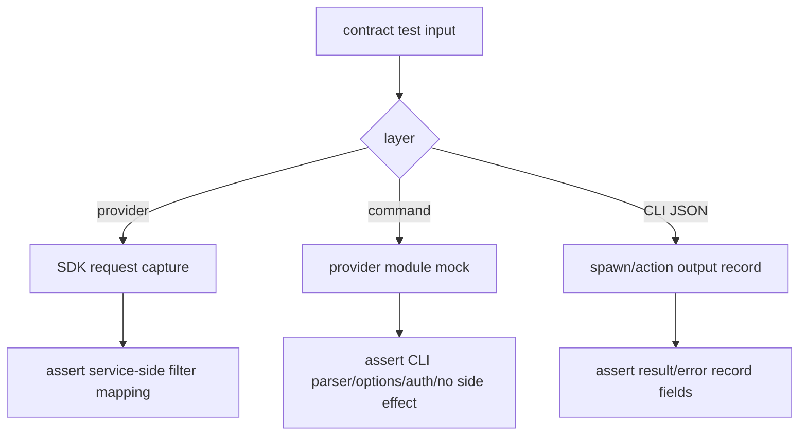

# ecs-filter-contract-tests feature design

## 0. 术语约定

| 术语 | 定义 | 防冲突结论 |
|---|---|---|
| filter contract | 用户传给 `ecs list` 的过滤参数，到 provider `EcsListInstancesOptions`，再到 ECS `DescribeInstancesRequest` 的端到端映射合同。 | 本 feature 只补测试锁定合同，不新增 filter surface。 |
| provider request shape | `ecs-readonly-provider` 构造出的 SDK request 字段和值。 | 必须通过 SDK/request mock 观察，不能靠本地后筛结果推断。 |
| command parser contract | `ecs list` CLI options 到 provider options 的转换规则。 | 通过 command test mock `../providers/ecs` 观察，不要求导出 parser helper。 |
| JSON payload contract | `ecs list/info --output json` 的业务 payload 字段稳定性。 | 外层 record 包络由 `output.ts` 负责，本 feature 只锁定 ECS payload 字段与 error category。 |

## 1. 决策与约束

### 需求摘要

本 feature 不新增用户能力，只把前面 provider/list/info 设计中最容易漂移的过滤与错误合同集中补强：

- 锁定 `tag/privateIp/publicIp/eip/name/namePrefix/status/region` 等过滤参数从 CLI 到 provider、从 provider 到 SDK request 的映射。
- 锁定 `--name` 与 `--name-prefix` 互斥、非法 `--tag`、空 `instanceId` 等 input error 分类。
- 锁定 `ecs info` not-found JSON error category 为 `not_found`。
- 锁定 `ecs list/info` JSON result payload 的字段白名单，并在 provider normalization 层证明敏感字段被剥离。
- 增加负向测试证明 provider/command 没有分页后本地 filtering。

明确不做：

- 不注册或修改 `licell ecs` 用户命令。
- 不新增 provider filter 或改变已有 filter 语义。
- 不修改 auth/RAM/doctor capability。
- 不手改 README generated block 或 agent surface docs。
- 不打真实阿里云；全部使用 module mock / SDK mock / CLI JSON 本地测试。
- 不把 lifecycle 操作纳入测试 surface；start/stop/reboot/delete 属后续 feature。

### 复杂度档位

走 contract-test 默认档位：`Robustness=L3`、`Structure=modules`、`Performance=reasonable`、`Readability=team`、`Testability=thorough`、`Security=validated`。

偏离点：

- `Testability=thorough`：这是防漂移 feature，核心产物就是测试证据，必须覆盖正向映射和负向“不得本地过滤”。
- `Security=validated`：JSON payload 与 text output 必须继续证明敏感字段不泄漏。

### 关键决策

1. **按层分测试，不把所有断言塞进一个巨型 e2e**  
   Provider request shape 用 `ecs-provider.test.ts` 的 SDK mock；command parser 用 `ecs-command.test.ts` provider mock；CLI JSON error/result 用轻量 integration 或 command action tests。每层只证明自己负责的 contract。为避免 DoD 漏跑，本 feature 不新增第三个 ECS 合同测试文件；若实现期确实需要新增文件，必须先同步 checklist 的 CMD-002。

2. **不要求导出 parser/request-builder 私有函数**  
   如果实现已把 parser/request builder 做成私有 helper，contract tests 通过 public command/provider seam 观察最终调用参数。只有现有 seam 无法观察时，才允许导出 test seam，并在 code review 中确认不扩大用户 surface。

3. **过滤不可表达时测试必须失败并回设计，不允许本地补偿**  
   如果 provider 不能把某 filter 映射进 SDK request，应回到 roadmap/command surface 调整，而不是让测试接受本地 `.filter()` 的行为。`publicIp/eip/namePrefix` 等依赖 ECS 服务端语义的选项以 provider 最终 surface 为准；若前置 provider feature 删除或改名，本 feature 对应断言同步删除或改名。

4. **错误分类测试靠真实 `output.ts` 分类链路**  
   input/not-found 分类不只断言 message 文案，还要通过 `emitCliError()` 或 CLI JSON record 的可观察输出证明 category 正确；不得为了测试导出私有 `detectErrorCategory()`。

5. **重复 `--tag` 是 characterization 重点**  
   `cac` 对重复 option 的 runtime 形态是项目内新模式；必须用 command test 覆盖单个 tag、多个 tag、非法 tag、空 key/value 边界。

### Top 3 风险与缓解

| 风险 | 缓解 |
|---|---|
| 测试只断言 provider 收到 filter，但漏掉 provider 又做本地后筛。 | Provider 负向测试：mock SDK 返回不匹配 filter 的实例，provider 仍原样返回，证明无 post-filter。 |
| CLI error 分类只测 Error.message，不测 JSON record category。 | 对 input/not-found 走真实 JSON error record 或 `emitCliError` 输出断言 `error.category`。 |
| 合同测试和前置 feature 单测重复太多，后续维护负担高。 | 本 feature 只补跨层/负向/JSON payload 防漂移断言；基础 success path 留在各 feature 原测试。 |

### 非显然依赖与关键假设

- 依赖 `ecs-readonly-provider`、`ecs-list-command`、`ecs-info-command` 的代码和基础测试已经落地；否则本 feature 的 tests 无法导入目标 command/provider。
- `src/__tests__/ecs-command.test.ts` 可以 mock `../providers/ecs` 并通过 `cac` command action 观察 provider options。
- `src/__tests__/ecs-provider.test.ts` 可以 mock ECS SDK client/request，或前置 provider 已提供可观测 request capture seam。
- 当前仓库可能没有 `node_modules`；实现前必须恢复依赖，`bun run typecheck` 是 core / fix-or-block。
- 本 feature 不创建 `src/__tests__/ecs-filter-contract.test.ts`；如果前置测试文件尚未存在，必须先完成对应前置 feature。

### 必跑验证命令

- `bun run typecheck`
- `bun x vitest run src/__tests__/ecs-provider.test.ts src/__tests__/ecs-command.test.ts`
- `bun x vitest run src/__tests__/cli-error.integration.test.ts src/__tests__/cli-help-json-contract.test.ts`
- `python3 .codestable/tools/validate-yaml.py --file .codestable/features/2026-07-03-ecs-filter-contract-tests/ecs-filter-contract-tests-checklist.yaml --yaml-only`

### 交付物与清洁度

交付物类别：

- ECS provider filter contract tests。
- ECS command parser / JSON payload / error category tests。
- 本 feature 的 review、QA、acceptance 报告。

清洁度规则：

- 不新增临时 `console.log`、TODO/FIXME、注释掉代码或未使用 import。
- 不为测试引入真实云凭证或打真实网络。
- 不新增 production command/auth/docs 行为。
- 不因测试方便把敏感 raw 字段加入 provider/command payload。

## 2. 名词与编排

### 2.1 名词层

#### 现状

- `ecs-readonly-provider` design 已要求 provider tests 覆盖 request shape、pagination、summary 白名单、not-found token 和反本地过滤。
- `ecs-list-command` design 已要求 command tests 覆盖 filter parser、repeatable tag、auth capability、JSON result 和 no-side-effect。
- `ecs-info-command` design 已要求 command tests 覆盖 region、not-found、白名单和敏感字段缺席。
- 现有 CLI integration tests 已有 JSON error 先例：`src/__tests__/cli-error.integration.test.ts` 通过 `spawnSync` 解析 `@@LICELL_JSON@@` records。
- `src/utils/output.ts` 的 category 规则对 input token 和 `isNotFoundError()` 顺序敏感；合同测试必须覆盖真实分类输出。

#### 变化

新增或扩展测试 contract：

```ts
// provider request shape contract
await listEcsInstances({
  regionId: 'cn-hangzhou',
  status: 'Running',
  namePrefix: 'prod-',
  tags: [{ key: 'env', value: 'prod' }],
  privateIpAddress: '10.0.0.1',
  publicIpAddress: '1.2.3.4',
  eipAddress: '47.0.0.1'
});
// request capture 断言：regionId/status/instanceName/tag/IP 字段都进入 SDK request
```

```ts
// command parser contract
await cli.parse([
  'node', 'src/cli.ts', 'ecs list',
  '--region', 'cn-hangzhou',
  '--tag', 'env=prod',
  '--tag', 'owner=team-a',
  '--name-prefix', 'prod-',
  '--private-ip', '10.0.0.1'
]);
expect(listEcsInstances).toHaveBeenCalledWith(expect.objectContaining({
  regionId: 'cn-hangzhou',
  tags: [{ key: 'env', value: 'prod' }, { key: 'owner', value: 'team-a' }],
  namePrefix: 'prod-',
  privateIpAddress: '10.0.0.1'
}));
```

```json
// JSON result payload contract
{
  "kind": "licell-cli-record",
  "schemaVersion": "1.0",
  "type": "result",
  "command": "ecs list",
  "stage": "ecs.list",
  "regionId": "cn-hangzhou",
  "filters": { "tags": [{ "key": "env", "value": "prod" }] },
  "instances": []
}
```

##### Interface 设计检查

- Module：测试 feature 横跨 ECS Provider 与 ECS CLI Command，但不新增 production module。
- Interface：锁定 provider public functions、CLI command actions、JSON records 这三个 caller-visible seam。
- Seam：provider seam 是 SDK request capture；command seam 是 provider module mock；CLI JSON seam 是 `extractJsonRecordsFromOutput()`。
- Depth / locality：把防漂移测试集中在 ECS 相关测试文件，不修改共享 output/registry 框架。
- Dependency strategy：local-substitutable；全部 mock 外部云。
- Adapter：不新增 adapter。
- Test surface：request shape、parser mapping、error category、payload whitelist、no post-filter、no side effect。

### 2.2 编排层

#### 主流程图



#### 现状

- Provider/list/info feature 各自已定义基础测试；但没有单独一条 roadmap item 汇总跨层防漂移。
- `collectCommandManifestIssues()` 只校验结构，不校验 filter semantics；filter semantics 必须靠 command/provider tests。
- JSON error/result record 是 agent-facing contract，不能只靠文本输出或 provider return type 推断。

#### 变化

本 feature 增加以下编排证据：

1. Provider contract tests：请求字段映射、反本地过滤、summary whitelist 和 raw 敏感字段剥离。
2. Command contract tests：CLI options 到 provider options、repeatable tags、input errors、auth capability、no side effects。
3. JSON contract tests：`ecs list/info --output json` success payload、input/not-found error category、sensitive field absence。

#### 流程级约束

- 测试不得依赖真实云账号、真实 AK/SK 或当前用户 `~/.licell-cli`。
- `--status` 必须原样透传，测试要包含大小写不规范值并断言不归一化。
- `--name-prefix` 在 command 层保持 `namePrefix`，provider 层再断言 request `instanceName` 为 `prefix*`；两层职责不要混测。
- `--name` 与 `--name-prefix` 同时出现必须是 input error；非法 tag 也必须是 input error。
- `ecs info` not-found 只代表当前 region 查不到，不触发跨 region fallback。

### 2.3 挂载点清单

- `src/__tests__/ecs-provider.test.ts`：provider request shape / no post-filter / whitelist / raw 敏感字段剥离。
- `src/__tests__/ecs-command.test.ts`：CLI parser、auth、result/error payload、no side-effect。
- 必要时 `src/__tests__/cli-error.integration.test.ts` / `src/__tests__/cli-help-json-contract.test.ts`：只补 ECS 相关 JSON record contract。

不列入挂载点：

- `src/commands/ecs.ts`、`src/providers/ecs/*`、auth/RAM/doctor 生产代码；除非测试暴露真实 bug，修复应回到对应前置 feature 的实现范围并在 review/QA 里说明。

### 2.4 推进策略

1. Provider filter contract：补齐 SDK request shape 和 no post-filter tests。  
   退出信号：provider tests 覆盖 region/instanceIds/name/namePrefix/status/tag/privateIp/publicIp/eip/vpc/vsw/zone/type/charge request shape，且 mock 不匹配实例时 provider 原样返回。
2. Command parser contract：补齐 CLI options 到 provider options tests。  
   退出信号：command tests 覆盖 `--region`、`--limit`、`--status` 原样透传、`--name`/`--name-prefix` 互斥、repeatable `--tag`、IP 三拆、instance-id 逗号分隔。
3. Error classification contract：锁定 input/not-found JSON error。  
   退出信号：非法 tag、name/namePrefix 互斥、空 instanceId 归 `input`；`ecs info` provider not-found 归 `not_found`。
4. JSON payload / sensitive whitelist contract：锁定 list/info result 字段。  
   退出信号：`ecs list/info --output json` payload 包含 roadmap 字段；provider mock SDK response 注入 rawAttribute/userData/vncUrl/consoleOutput/password/keyPairPrivateKey 时，归一化后的 summary/detail、JSON 与文本输出均不包含这些字段。命令层缺席断言只作为防回归，真正证明点在 provider normalization。
5. Validation cleanup：运行验证并确认 scope 未漂移。  
   退出信号：typecheck、ecs provider/command tests、CLI JSON tests、checklist yaml 校验通过，diff 不包含新命令、auth/RAM/doctor、generated docs 或真实云调用。

### 2.5 结构健康度与微重构

##### Compound 检索

`.codestable/compound/` 当前没有命中“测试目录 / contract / filter / 命名”相关沉淀。

##### 评估

- 测试级 — `src/__tests__/ecs-provider.test.ts`：由 provider feature 创建，适合承载 provider request shape、normalization 和敏感字段剥离合同。
- 测试级 — `src/__tests__/ecs-command.test.ts`：由 list/info command feature 创建，适合承载 command parser 和 JSON payload 合同。
- 测试级 — `src/__tests__/cli-error.integration.test.ts`：已有 spawn-based JSON error e2e，适合少量 CLI record 合同，但不适合大量 filter matrix。

##### 结论：不做微重构

本 feature 是测试补强，不需要重组测试目录。为保持 DoD 命令精确，本轮不新增 `ecs-filter-contract.test.ts`；若单个 test 文件超过可读阈值，应先修订 checklist 的验证命令再拆文件，不在实现中临时绕开。

##### 超出范围的观察

- 如果后续多个云产品都需要类似 filter contract matrix，可另起 testing convention/refactor 抽共享 helper；本 feature 不先抽象。

## 3. 验收契约

### 关键场景

- S1 provider request shape：所有 roadmap filter 进入 SDK request 对应字段，`namePrefix` 转 `prefix*`。
- S2 no post-filter：SDK mock 返回不匹配 filter 的实例时，provider 原样返回。
- S3 command parser：CLI options 映射到 provider options，`status` 原样透传，`--tag` 可重复。
- S4 input errors：非法 tag、`name` + `namePrefix`、空 instanceId 归 `input`。
- S5 not-found：`ecs info` not-found 归 `not_found`，不跨 region fallback。
- S6 JSON list payload：`ecs list` result 包含 `regionId/count/limit/totalCount/truncated/filters/instances[]`。
- S7 JSON info payload：`ecs info` result 包含 `regionId/instanceId/detail.summary`。
- S8 sensitive guard：provider mock 注入 raw 敏感字段时，summary/detail、list/info JSON 和文本不含敏感字段。
- S9 no side effects：测试不需要真实云，不写项目状态，不修改 auth/docs/generated surface。

### Acceptance Coverage Matrix

| 场景 | Checklist step | 证据类型 | 核心 |
|---|---|---|---|
| S1 / S2 provider mapping + no post-filter | Step 1 | unit test / request capture | yes |
| S3 command parser | Step 2 | command test / provider mock | yes |
| S4 input errors | Step 3 | command/integration test / JSON error category | yes |
| S5 not-found | Step 3 | command/integration test / JSON error category | yes |
| S6 / S7 JSON payload | Step 4 | JSON record assertion | yes |
| S8 sensitive guard | Step 4 | provider unit test / JSON assertion / diff review | yes |
| S9 no side effects | Step 5 | diff review / validation output | yes |

### DoD Contract

| Gate | Contract |
|---|---|
| Design DoD | 本 design/checklist 通过独立 design-review；保持 draft，等待 epic 批量统一确认。 |
| Implementation DoD | ECS filter、error、payload 合同测试全部落地并通过。 |
| Review DoD | 独立 code review 重点检查测试是否真正观察服务端 request shape、没有用本地过滤满足断言。 |
| QA DoD | 跑 typecheck、ECS provider/command tests、CLI JSON tests。 |
| Acceptance DoD | 验收报告证明本 feature 没新增用户命令，只补防漂移测试。 |

Required artifacts：

- `ecs-filter-contract-tests-review.md`
- `ecs-filter-contract-tests-qa.md`
- `ecs-filter-contract-tests-acceptance.md`
- 相关测试命令输出

## 4. 与项目级架构文档的关系

本 feature 不改变架构，只补 ECS 查询合同测试。若测试发现某个 filter 无法被 ECS 服务端 request 表达，应回到 roadmap/对应 command/provider feature 修订 surface，而不是在本 feature 中扩大行为。
