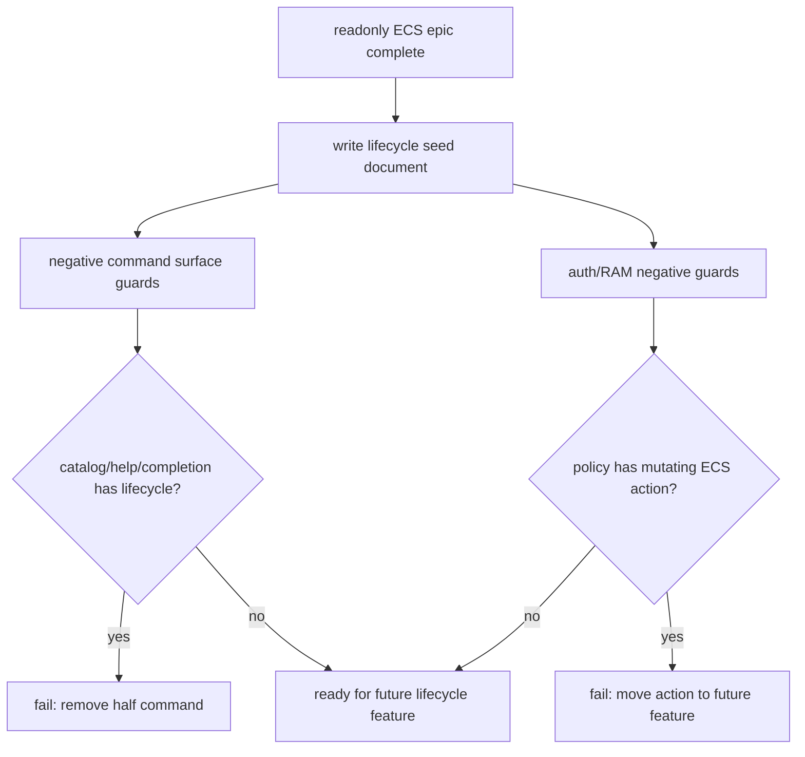

# ecs-lifecycle-command-scaffold feature design

## 0. 术语约定

| 术语 | 定义 | 防冲突结论 |
|---|---|---|
| lifecycle command | ECS 实例生命周期操控命令，如 start、stop、reboot、delete/rm。 | 本 feature 只写未来设计种子，不注册任何 lifecycle command。 |
| scaffold / seed | 可供后续 `cs-feat` 直接消费的设计边界、命令合同、权限和测试清单。 | 不是空实现，也不是 hidden command。 |
| safety metadata | `CommandSafetyMetadata` 中的 safe / mutating / destructive、reason、confirmFlags。 | 后续 lifecycle feature 必须显式声明，不依赖隐式推断。 |
| dry-run | 高影响命令的计划预览模式，只返回将调用的 action、region、instanceId、precheck，不实际调用云端 mutating API。 | 本 feature 只设计 dry-run 语义，不实现 provider 调用。 |

## 1. 决策与约束

### 需求摘要

本 feature 在只读 ECS 查询闭环完成后，为后续“操控”命令沉淀安全边界：

- 产出一份后续 lifecycle command seed 文档，明确 start/stop/reboot/rm 的 safety level、confirm flags、dry-run、precheck、RAM action 和测试要求。
- 增加命令面守护：当前 epic 结束时 `catalog` / help / docs / completion 仍不能暴露 lifecycle 半命令。
- 明确后续每个 lifecycle command 必须先读取 `ecs info` 当前状态，再做 dry-run / confirm / execute / verify 的流程。
- 明确后续 mutating RAM action 不提前加入本轮 bootstrap policy；只读 ECS epic 保持 Describe 权限最小集。

明确不做：

- 不注册 `licell ecs start`、`stop`、`reboot`、`delete`、`rm`、`run`、`create` 等命令。
- 不新增 ECS provider lifecycle API wrapper。
- 不修改 `AuthCapability='ecs'` 的 action list；不加入 `ecs:StartInstance`、`StopInstance`、`RebootInstance`、`DeleteInstance`、`RunInstances`。
- 不修改 doctor probe；doctor 仍只做 `listEcsInstances({ limit: 1 })` 等价只读探测。
- 不写 `.licell/project.json` 的 ECS 绑定状态。

### 复杂度档位

走 safety/design-seed 默认档位：`Robustness=L3`、`Structure=docs+guards`、`Performance=not-applicable`、`Readability=handoff-ready`、`Testability=guarded`、`Security=validated`。

偏离点：

- `Security=validated`：本 feature 的价值是防止后续高风险命令被无意混入只读 epic，因此必须有负向 guard。
- `Structure=docs+guards`：本轮只产生设计种子和测试守护，不产生 runtime command。

### 关键决策

1. **未来 lifecycle 命令按风险拆 feature，不一次性全开**  
   `start` / `reboot` 是 mutating，`stop` 可能造成业务中断，`rm/delete` 是 destructive。后续至少应按“start/reboot/stop”与“delete/rm”分开 design/review，避免删除语义拖累普通启动操作。

2. **后续命令必须显式 safety metadata**  
   现有 `command-semantics.ts` 会把 `start/restart` 推为 mutating，把 `stop/delete/rm` 推为 destructive，但 ECS lifecycle 不能只依赖推断。后续 descriptor 必须写 `safety.level`、`reason`、`confirmFlags`。

3. **dry-run 是所有 ECS mutating 命令的机器可读前置**  
   后续 lifecycle 命令应支持 `--dry-run --output json`，返回 `{ action, regionId, instanceId, currentStatus, plannedRequest, requiredCapabilities, willExecute: false }`，不调用云端 mutating API。

4. **destructive / interruption 操作必须有显式确认**  
   `rm/delete` 必须使用 `--yes` 与 `ensureDestructiveActionConfirmed()`；`stop` 虽不是删除，但会中断业务，后续 design 应要求 `--yes` 或等价确认策略。非交互 JSON automation 必须传确认 flag，不能默默执行。

5. **RAM action 按命令最小授予，不能提前进本轮只读 policy**  
   后续 start/stop/reboot/delete/run feature 才能讨论 `ecs:StartInstance`、`ecs:StopInstance`、`ecs:RebootInstance`、`ecs:DeleteInstance`、`ecs:RunInstances` 等 action；当前 `CAPABILITY_ACTIONS.ecs` 和 `LICELL_POLICY_ACTIONS` 只保留 Describe。

### Top 3 风险与缓解

| 风险 | 缓解 |
|---|---|
| 设计种子被误实现为 hidden/半成品 command，污染 help/catalog。 | Step 2/3 用 manifest/catalog/help/completion 负向测试和 diff review 证明无 lifecycle 命令注册。 |
| 后续 lifecycle feature 复用只读 `ecs` capability，导致 bootstrap policy 提前扩大。 | Seed 文档明确 future capability/action 策略；Step 2 断言当前 RAM/auth 不含 mutating ECS action。 |
| `stop` 风险被低估，只依赖自动 safety 推断而没有 interruption 专属确认/文案。 | Seed 文档单独标出 `stop` 为 interruption command，后续必须有 confirm 或 dry-run gate。 |

### 非显然依赖与关键假设

- 本 feature 依赖 `ecs-filter-contract-tests` 与 `ecs-command-surface-docs` 之后执行；此时只读 command surface 已稳定，才能写负向 guard。
- 本 feature 也依赖 `ecs-auth-read-permissions` 已落地 `AuthCapability='ecs'` 与只读 action list；否则 auth/RAM guard 应先等待前置实现，而不是对 `undefined` capability 做断言。
- 当前 `ensureDestructiveActionConfirmed()` 文案写的是“删除操作”；后续若 `stop` 也要求确认，可能需要新增更通用的 `ensureHighImpactActionConfirmed()`。本 feature 只记录观察，不改 helper。
- `CommandSafetyMetadata.confirmFlags` 只自动收集 `--yes` / `--apply` / `--force`；后续若引入 `--confirm-stop` 等新 flag，需要同步 surface metadata 规则或显式 descriptor。

### 必跑验证命令

- `bun run typecheck`
- `bun x vitest run src/__tests__/command-reference.test.ts src/__tests__/command-manifest.test.ts src/__tests__/command-surface-metadata.test.ts`
- `bun x vitest run src/__tests__/cli-help-json-contract.test.ts src/__tests__/shell-completion.test.ts`
- `bun x vitest run src/__tests__/auth-recovery.test.ts src/__tests__/ram-bootstrap.test.ts`
- `python3 .codestable/tools/validate-yaml.py --file .codestable/features/2026-07-03-ecs-lifecycle-command-scaffold/ecs-lifecycle-command-scaffold-checklist.yaml --yaml-only`

### 交付物与清洁度

交付物类别：

- `.codestable/roadmap/ecs-operations-support/ecs-lifecycle-command-seeds.md` 后续 feature 种子文档。
- command surface / auth policy 负向 guard tests。
- 本 feature 的 review、QA、acceptance 报告。

清洁度规则：

- 不新增临时 `console.log`、TODO/FIXME、注释掉代码或未使用 import。
- 不新增 production lifecycle command 或 provider mutating wrapper。
- 不把 mutating ECS RAM action 加入当前只读 capability/policy。
- 不手改 generated docs。

## 2. 名词与编排

### 2.1 名词层

#### 现状

- `src/commands/module.ts` 定义 `CommandSafetyLevel = 'safe' | 'mutating' | 'destructive'` 与 `CommandSafetyMetadata`；`src/utils/command-metadata.ts` 重新导出并消费这些类型。
- `src/utils/command-semantics.ts` 会从 command key 推断 safety：`start/restart` → mutating，`stop/delete/rm` → destructive。
- `src/utils/cli-shared.ts` 的 `ensureDestructiveActionConfirmed()` 支持 `--yes` 跳过、非交互缺 `--yes` 报错、交互双确认。
- `task config rm` 显式 descriptor safety destructive + `confirmFlags: ['--yes']`，并在命令里调用 `ensureDestructiveActionConfirmed()`。
- 本 epic 的 auth 目标态由 `ecs-auth-read-permissions` 提供：`AuthCapability='ecs'` 只允许 `ecs:DescribeInstances` / `ecs:DescribeInstanceAttribute`，不允许 lifecycle action；当前 main 未实现前不能把它当作现有代码事实。

#### 变化

新增设计种子文档，建议路径：

```text
.codestable/roadmap/ecs-operations-support/ecs-lifecycle-command-seeds.md
```

文档至少包含：

```markdown
# ECS lifecycle command seeds

## Phase split

- ecs-start-reboot-command：start / reboot，mutating，必须支持 --dry-run。
- ecs-stop-command：stop，业务中断风险，必须支持 --dry-run 和显式确认。
- ecs-delete-command：rm/delete，destructive，必须支持 --dry-run、--yes、双确认。

## Common preflight

1. Resolve region: --region -> auth region.
2. Read current instance via getEcsInstanceDetail(instanceId, { regionId }).
3. Validate target state and idempotency.
4. If --dry-run: emit plannedRequest and willExecute=false.
5. If high-impact: require confirmation.
   - Do not reuse delete-specific confirmation wording for stop/reboot; add a generic high-impact/interruption confirmation helper or command-specific text.
   - If adding a new confirmation flag such as --confirm-stop, update surface metadata or declare it explicitly so help/catalog/completion expose it.
6. Execute ECS API.
7. Verify by reading detail/list again.
```

未来 command seed 表：

| Future command | Safety | Confirm | Dry-run | Future RAM action | Precheck |
|---|---|---|---|---|---|
| `ecs start <instanceId>` | mutating | no by default, review required | required | `ecs:StartInstance` | current status is stopped-like |
| `ecs reboot <instanceId>` | mutating/high-impact | likely `--yes` for automation | required | `ecs:RebootInstance` | current status running |
| `ecs stop <instanceId>` | destructive/interruption | required | required | `ecs:StopInstance` | warn service interruption |
| `ecs rm/delete <instanceId>` | destructive | `--yes` + double confirm | required | `ecs:DeleteInstance` | instance, disks, release behavior explicit |
| `ecs run/create` | mutating/cost | separate epic | required | `ecs:RunInstances` plus network/disk/image actions | cost/network/security plan |

##### Interface 设计检查

- Module：本 feature 不新增 runtime module；新增的是 roadmap seed 文档和 guard tests。
- Interface：后续 `cs-feat` 以 seed 文档为输入；当前用户/Agent 不看到 lifecycle command。
- Seam：guard seam 是 command catalog/help/completion 和 auth/RAM action lists。
- Depth / locality：安全策略先沉淀在 roadmap seed，不把未实现分支塞进 `src/commands/ecs.ts`。
- Dependency strategy：in-process tests + diff review。
- Adapter：不新增 adapter。

### 2.2 编排层

#### 主流程图



#### 现状

- 只读 ECS features 会注册 `ecs list/info` 和 safe metadata。
- Roadmap 只在文字上说“为后续 start/stop/reboot/rm 预留安全设计”，尚无可消费的后续 feature seed。
- 现有 command surface tests 能检查 command reference、manifest、help JSON 和 completion 候选。

#### 变化

1. 产出 lifecycle seed 文档，作为后续 feature 输入。
2. 增加或扩展负向 guard tests：
   - `buildAgentCommandCatalog()` / `buildCommandReferenceSections()` 不包含 `ecs start`、`ecs stop`、`ecs reboot`、`ecs rm`、`ecs delete`、`ecs run`。
   - `licell ecs --help --output json` 的 subcommands 只包含 list/info。
   - `resolveCompletionCandidates()` 在 `ecs` namespace 下只返回 list/info 和全局 options。
   - `CAPABILITY_ACTIONS.ecs` 等于只读白名单 `ecs:DescribeInstances` / `ecs:DescribeInstanceAttribute`；`LICELL_POLICY_ACTIONS` 不包含 Start/Stop/Reboot/Delete/RunInstances 等 mutating lifecycle action。
3. 不修改 production `src/commands/ecs.ts`，除非前置 feature 已泄漏 lifecycle 半命令，需要删除回只读 surface。

#### 流程级约束

- Seed 文档必须明确“后续 feature 才能实现”，不要写成当前用户指南。
- Seed 文档必须承载两条 caveat：`ensureDestructiveActionConfirmed()` 是删除语义，stop/reboot 不能复用错误文案；`confirmFlags` 自动收集只覆盖 `--yes` / `--apply` / `--force`，新增确认 flag 需同步 metadata 或显式 descriptor。
- Guard tests 只断言当前不暴露半命令；不需要为未来命令写 snapshot。
- 如果已有 docs generated block 因前置误漏出现 lifecycle，先修 source descriptor，再 docs sync；不手改 generated docs。
- auth/RAM guard 必须先确认 `ecs-auth-read-permissions` 已落地；`CAPABILITY_ACTIONS.ecs` 断言等于只读 Describe 白名单，bootstrap policy 断言不含 mutating action 黑名单：`ecs:StartInstance`、`ecs:StopInstance`、`ecs:RebootInstance`、`ecs:DeleteInstance`、`ecs:RunInstances`。

### 2.3 挂载点清单

- `.codestable/roadmap/ecs-operations-support/ecs-lifecycle-command-seeds.md`：后续 feature 种子。
- `src/__tests__/command-reference.test.ts` / `command-surface-metadata.test.ts` / `cli-help-json-contract.test.ts` / `shell-completion.test.ts`：命令面负向 guard。
- `src/__tests__/auth-recovery.test.ts` / `ram-bootstrap.test.ts`：ECS mutating action 负向 guard。

不列入挂载点：

- `src/commands/ecs.ts` lifecycle command 注册。
- `src/providers/ecs/*` lifecycle API wrapper。
- `src/utils/auth-recovery.ts` capability action 扩权。
- generated docs 手工编辑。

### 2.4 推进策略

1. Lifecycle seed document：写后续 feature 种子。  
   退出信号：seed 文档包含 phase split、common preflight、future command safety/confirm/dry-run/RAM 表、确认 helper 文案 caveat、confirmFlags 自动收集边界、明确当前不实现。
2. Command surface negative guards：锁定只读 surface。  
   退出信号：catalog/help/reference/completion tests 断言 ECS 当前只有 list/info，不含 start/stop/reboot/rm/delete/run/create。
3. Auth/RAM negative guards：锁定只读权限。  
   退出信号：前置 `ecs-auth-read-permissions` 已合入；auth/RAM tests 断言 `CAPABILITY_ACTIONS.ecs` 等于只读 Describe 白名单，bootstrap policy 不含 ECS mutating action 黑名单。
4. Future design notes quality pass：检查 seed 可被后续 `cs-feat` 消费。  
   退出信号：seed 文档每条 future command 有 scope、safety、confirm、dry-run、precheck、RAM、tests；无当前用户执行说明。
5. Validation cleanup：运行验证并确认 scope 未漂移。  
   退出信号：typecheck、surface/auth tests、YAML 校验通过；diff 不包含 production lifecycle command/provider wrapper/generated docs 手改。

### 2.5 结构健康度与微重构

##### Compound 检索

`.codestable/compound/` 当前没有命中 “ECS lifecycle / destructive command / dry-run” 相关沉淀。

##### 评估

- `.codestable/roadmap/ecs-operations-support/` 适合承载后续 seed，因为它是本 epic 的上下文目录。
- 现有 `command-semantics.ts` 的 safety 推断较通用；本 feature 不改规则，避免为未实现 ECS lifecycle 提前泛化。
- `ensureDestructiveActionConfirmed()` 文案偏删除语义；后续 stop/reboot 若需要确认，可能值得另起 shared helper refactor。

##### 结论：不做微重构

本 feature 只写 seed 和 guard，不需要拆生产代码。后续真正实现 lifecycle 时，再基于具体命令决定是否抽 `ensureHighImpactActionConfirmed()` 或 ECS lifecycle provider module。

## 3. 验收契约

### 关键场景

- S1 seed document：存在后续 lifecycle seed 文档，覆盖 start/reboot/stop/rm/delete/run 的安全边界。
- S2 command surface guard：catalog/help/reference/completion 不暴露 ECS lifecycle 半命令。
- S3 auth/RAM guard：当前 ECS capability/policy 不包含 mutating ECS action。
- S4 future safety contract：seed 文档对 safety level、confirm flags、dry-run、precheck、verify 都有可执行约束。
- S5 no production behavior：diff 不新增 provider lifecycle wrapper、不修改 command runtime、不写 generated docs。

### Acceptance Coverage Matrix

| 场景 | Checklist step | 证据类型 | 核心 |
|---|---|---|---|
| S1 seed document | Step 1 / Step 4 | file review | yes |
| S2 command surface guard | Step 2 | unit/integration test | yes |
| S3 auth/RAM guard | Step 3 | unit test | yes |
| S4 future safety contract | Step 4 | file review | yes |
| S5 no production behavior | Step 5 | diff review / validation output | yes |

### DoD Contract

| Gate | Contract |
|---|---|
| Design DoD | 本 design/checklist 通过独立 design-review；保持 draft，等待 epic 批量统一确认。 |
| Implementation DoD | lifecycle seed 文档落地，负向 guard 测试通过，当前命令面仍只暴露 list/info。 |
| Review DoD | 独立 code review 重点检查没有 hidden command/provider wrapper/RAM 扩权。 |
| QA DoD | 跑 typecheck、command surface tests、auth/RAM tests、YAML 校验。 |
| Acceptance DoD | 验收报告证明本 feature 只产生后续设计种子与 guard，不开放 ECS 操控命令。 |

Required artifacts：

- `.codestable/roadmap/ecs-operations-support/ecs-lifecycle-command-seeds.md`
- `ecs-lifecycle-command-scaffold-review.md`
- `ecs-lifecycle-command-scaffold-qa.md`
- `ecs-lifecycle-command-scaffold-acceptance.md`
- 相关测试命令输出

## 4. 与项目级架构文档的关系

本 feature 不改变 runtime 架构；它把后续高影响 ECS 操作的安全策略留在 roadmap seed 中。若后续真正实现 lifecycle command，应基于 seed 另起 feature design，并视确认 helper / high-impact safety 是否需要 `cs-domain` ADR。
