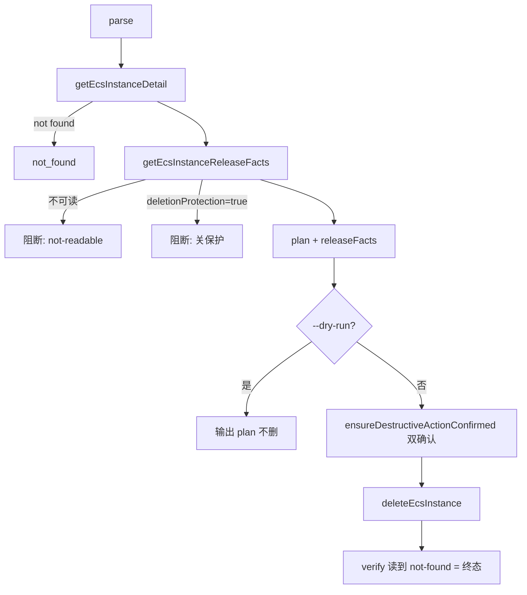

# ecs-lifecycle-delete feature design

## 0. 术语约定

| 术语 | 定义 | 防冲突结论 |
|---|---|---|
| `ecs rm` / `ecs delete` | 释放实例的 destructive 命令（rm 为 delete 别名）。 | 复用 harness；用现有 `ensureDestructiveActionConfirmed` 删除双确认，非 high-impact helper。 |
| `getEcsInstanceReleaseFacts` | 只读读取删除保护/磁盘/释放行为的事实查询（roadmap §4.1）。 | 现有 `EcsInstanceSummary` 无这些字段；新增只读查询，不复用 detail。 |
| `deleteEcsInstance` | 只发 `DeleteInstance` 单实例 API 的 provider wrapper。 | 与其它 lifecycle wrapper 同文件。 |

## 1. 决策与约束

### 需求摘要（依赖 ecs-lifecycle-start-reboot）

- 新增 `getEcsInstanceReleaseFacts({ instanceId, regionId? })` → `EcsInstanceReleaseFacts`（deletionProtection/disks[]/releaseBehavior），只读。
- 新增 `deleteEcsInstance({ instanceId, regionId?, force? })`，只发 `DeleteInstance`。
- `EcsLifecycleAction` 扩 `'delete'`；harness delete 分支：precheck 读 releaseFacts，**事实不可读时阻断执行**（not-readable 错误，不默认放行）；plan 带 `releaseFacts`；verify 以 not-found 为删除终态成功。
- `ecs rm`/`ecs delete` 命令：`safety.level='destructive'`、`confirmFlags=['--yes']`，走 `ensureDestructiveActionConfirmed`。确认语义按现有 helper 契约（FDR-001）：**`--yes` 显式跳过交互确认直接执行；无 `--yes` 且交互 TTY 才走两次 prompt 双确认；非交互无 `--yes` 阻断报错**。deletionProtection=true 时阻断并提示（先于确认）。
- RAM 追加 `ecs:DeleteInstance`（+ 只读 `ecs:DescribeDisks` 若释放事实需要）（决策 A，与 start/reboot 分开 review）。
- guard 断言更新为暴露 start/reboot/stop/delete/rm；仍不暴露 run/create。

### 明确不做

- 不实现 run/create。
- 不改 harness 已冻结对外契约（只加 delete 分支 + releaseFacts 可选字段消费）。
- 不做磁盘单独释放/保留的交互式选择（MVP 按 ECS 默认 + 显式回显 releaseBehavior；如需可配置另开范围）。
- **generated docs（README/agent-surfaces/scenario）收口完全留给 `ecs-lifecycle-surface-harden`**（FDR-002）：本 feature 只保证 command registry / catalog / help / completion 测试绿，不跑 `docs:sync`、不手改 generated docs。

### 复杂度档位

`Security=validated` / `Robustness=L3`：删除不可逆，双确认 + 删除保护拦截 + 释放事实阻断都不可绕过。

### 关键决策 / 假设

1. **释放事实不可读 → 阻断而非放行**（roadmap RMR-001）：delete 最危险，宁可拦截也不在信息缺失下删除。
2. **deletionProtection=true → 阻断**：提示用户先关删除保护，命令不代关。
3. **rm 是 delete 别名**：同一 action，注册两个 rawName 或 alias，descriptor 一致。
4. **假设**：`DeleteInstance` 参数 `InstanceId`/`Force`；删除保护字段来自 `DescribeInstances`/`DescribeInstanceAttribute` 的 `DeletionProtection`，磁盘 `DeleteWithInstance` 来自 `DescribeDisks` —— implement 用 SDK types 核实（residual）。

## 2. 名词层与编排层

### 2.1 名词层（现状 → 变化）
**现状**：harness 的 `EcsLifecyclePlan` 已预留 `releaseFacts?`（roadmap §4.2）；`EcsInstanceSummary` 无释放字段。
**变化**：新增 `EcsInstanceReleaseFacts`（roadmap §4.1）；provider 加 `getEcsInstanceReleaseFacts`、`deleteEcsInstance`；`EcsLifecycleAction` 扩 `'delete'`。

示例：
```
输入: ecs rm i-x --output json（存在，deletionProtection=false，交互双确认通过或 --yes）
plan: { action:'delete', releaseFacts:{ deletionProtection:false, deleteWithDisks:true, releaseBehavior:'released' }, willExecute:true, ... }
execution: { requestId:'...' }
verify: { notFound:true, reachedTarget:true }
```

### 2.2 编排层（现状 → 变化）
**现状**：harness read→plan→precheck→dry-run→confirm→execute→verify。
**变化**：delete 分支在 precheck 阶段追加 `getEcsInstanceReleaseFacts`：
- 事实不可读 → 阻断（not-readable 错误）
- deletionProtection=true → 阻断（提示关保护）
- 确认走 `ensureDestructiveActionConfirmed`（双确认）而非 high-impact helper
- verify：DeleteInstance 后重读 detail，读到 not-found 即 `notFound:true, reachedTarget:true`



### 2.3 挂载点
1. `getEcsInstanceReleaseFacts` + `deleteEcsInstance` + barrel 导出
2. `ecs rm`/`ecs delete` 命令注册
3. `CAPABILITY_ACTIONS.ecs`/`LICELL_POLICY_ACTIONS` 的 DeleteInstance(+DescribeDisks)
4. harness delete 分支（releaseFacts 阻断逻辑）

### 2.4 推进策略
1. provider `getEcsInstanceReleaseFacts` + `deleteEcsInstance` + 单测（release facts 读取、DeleteInstance shape、不可读错误）
2. harness delete 分支：releaseFacts 阻断、deletionProtection 阻断、verify not-found 终态 + 单测
3. `ecs rm`/`ecs delete` 命令 + descriptor（destructive、双确认）+ 单测
4. RAM DeleteInstance(+DescribeDisks) + guard 更新（暴露 delete/rm、不暴露 run/create）

### 2.5 结构健康度与微重构
delete 逻辑加入 `src/commands/ecs-lifecycle.ts`（命令）与 `src/providers/ecs/lifecycle.ts`（provider wrapper）。若届时 `src/providers/ecs/lifecycle.ts` 因四命令累积偏胖，**评估：可把 release-facts 查询拆到 `src/providers/ecs/release-facts.ts`**；结论待 implement 按实际行数定，design 层记为"可选微重构，只搬不改行为"，不阻塞。目录级无变化。

## 3. 验收契约

| # | 输入 / 触发 | 期望可观察结果 | 证据类型 |
|---|---|---|---|
| D1 | `ecs rm i-x --dry-run --output json` | willExecute=false，DeleteInstance 未被调用，plan.releaseFacts 有值 | 单测 |
| D2 | `ecs rm i-x --yes`（无保护） | `--yes` 跳过交互确认，调 DeleteInstance，verify notFound=true | 单测 |
| D2b | `ecs rm i-x`（交互 TTY，无 --yes，无保护） | 走两次 prompt 双确认后调 DeleteInstance | 单测（mock confirmPrompt） |
| D3 | `ecs rm i-x` 非交互无 `--yes` | 抛错指明需 `--yes`，不调 DeleteInstance | 单测 |
| D4 | releaseFacts 不可读 | 阻断（not-readable 错误），不调 DeleteInstance | 单测 |
| D5 | deletionProtection=true | 阻断并提示关保护，不调 DeleteInstance | 单测 |
| D6 | 确认文案 | 删除语义（复用 ensureDestructiveActionConfirmed 的"将删除云端资源"文案） | 单测 |
| D7 | `ecs delete i-missing` | not_found 错误 | 单测 |
| D8 | `ecs rm` 与 `ecs delete` | 同一 action，行为一致 | 单测 |
| D9 | catalog/help/completion | 暴露 start/reboot/stop/delete/rm，不暴露 run/create；delete.level=destructive、confirmFlags=['--yes'] | 单测 |
| D10 | RAM | 含 DeleteInstance，不含 RunInstances | 单测 |

**明确不做反向核对**：无 run/create 命令；provider 无 run/create wrapper；policy 无 RunInstances。

### Acceptance Coverage Matrix
| 场景 | precheck/facts | dry-run | confirm | verify | surface | RAM |
|---|---|---|---|---|---|---|
| delete | D4/D5 | D1 | D2/D3/D6 | D2 | D9 | D10 |
| 别名 | — | — | — | — | D8 | — |
| 错误 | D7 | — | D3 | — | — | — |

### DoD Contract
- 必跑：`bun run typecheck`、ecs-lifecycle tests、manifest/help/completion/auth/ram guard tests、`validate-yaml.py`
- 证据：command_output、diff_summary、review_report、qa_report、acceptance_report
- 清洁度：禁调试输出/TODO/注释代码/死 import

## 执行风险与证据计划
- **Top 3 风险**：信息缺失下误删（D4/D5 阻断缓解）；确认被绕过（D3/D6 缓解）；dry-run 触发删除（D1 缓解）。
- **非显然依赖**：feature1 harness/releaseFacts 字段；SDK DeleteInstance/DeletionProtection/DescribeDisks 字段名（residual）。
- **关键假设**：不可读即阻断（决策1）；deletionProtection 阻断（决策2）；SDK 字段名（决策4）。
- **交付物**：`lifecycle.ts`(+release-facts/delete)、`ecs-lifecycle.ts`(+delete/rm)、`auth-recovery.ts`/`ram.ts`(+DeleteInstance/DescribeDisks)、tests。
- **清洁度**：无临时输出/TODO。
