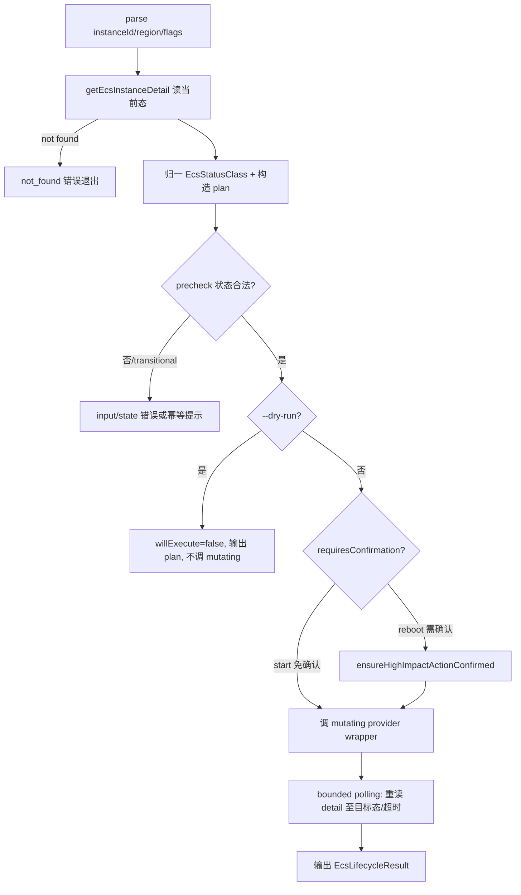

# ecs-lifecycle-start-reboot feature design

## 0. 术语约定

| 术语 | 定义 | 防冲突结论 |
|---|---|---|
| lifecycle harness | 供 start/reboot/stop/delete 复用的编排层：读 detail → 构造 plan → precheck/幂等 → dry-run 分流 → 确认 → 执行 → bounded verify。 | 现有 `src/commands/ecs.ts` 只有 list/info 的一次性 action，无共享 mutating 编排；harness 是新增编排层。 |
| `EcsStatusClass` | ECS 原生状态归一类别：`running-like`/`stopped-like`/`transitional`/`unknown`。 | 现有 provider 只透传原生 `status` 字符串，无归一；本 feature 首次引入类别判断。 |
| mutating provider wrapper | `startEcsInstance`/`rebootEcsInstance`，各只发对应单实例 ECS API。 | 与只读 `query.ts` 平级新增 `lifecycle.ts`；不改 `query.ts`。 |
| `ensureHighImpactActionConfirmed` | 非删除语义的中断/重启确认 helper。 | 现有 `ensureDestructiveActionConfirmed`（cli-shared.ts:198）用"将删除云端资源"删除文案，不能复用于 reboot。 |

## 1. 决策与约束

### 需求摘要

按 roadmap `ecs-lifecycle-operations` §3-§4 硬约束，交付：

- `src/providers/ecs/lifecycle.ts`：`startEcsInstance` / `rebootEcsInstance`（roadmap §4.1 签名），各只发 `StartInstance` / `RebootInstance` 单实例 API，返回 `{action, regionId, instanceId, requestId}`。
- lifecycle harness（`src/commands/ecs.ts` 内新增编排，或抽到 `src/commands/ecs-lifecycle.ts`）：构造 `EcsLifecyclePlan`、`EcsStatusClass` 归一、precheck/幂等、`--dry-run` 分流、bounded polling verify，返回 roadmap §4.2 的 `EcsLifecycleResult`。
- `ensureHighImpactActionConfirmed`（`src/utils/cli-shared.ts`）：非删除文案，非交互无 `--yes` 抛错。
- `ecs start <instanceId>` / `ecs reboot <instanceId>` 命令，descriptor safety 显式（start=mutating/免确认，reboot=mutating/需 `--yes`），recommendedFlow 覆盖 dry-run→execute→verify。
- RAM：`CAPABILITY_ACTIONS.ecs` 与 `LICELL_POLICY_ACTIONS` 追加 `ecs:StartInstance`、`ecs:RebootInstance`（决策 A，扩单一 `ecs` capability）。
- guard 测试：把只读 epic "只暴露 list/info"断言更新为"含 start/reboot"，其余 lifecycle（stop/delete）仍不得暴露。

### 明确不做

- 不实现 stop / delete / run / create（后续 feature；provider wrapper 只加 start/reboot）。
- 不做批量 / 跨 region 搜索。
- 不引入 `--confirm-stop` 等新确认 flag（统一复用 `--yes`，避免 `collectConfirmFlags` 漏收）。
- 不改只读 `query.ts` 的 list/info 行为。
- 不手改 README generated block / agent-surfaces.md（收口留给 surface-harden feature；本 feature 只保证 catalog/help/manifest 测试通过）。

### 复杂度档位

CLI mutating 命令默认档位偏 `Security=validated`、`Robustness=L3`、`Testability=tested`：mutating 命令必须验证 dry-run 不触发副作用、precheck 拦截非法态、确认路径不可绕过。

### 关键决策 / 假设

1. **harness 抽独立编排单元**：start/reboot/stop/delete 共用，故 plan/precheck/verify 收敛为参数化 `EcsLifecycleAction`，行为差异（目标态、是否确认）由 per-action 配置表达，避免每命令各自发明。
2. **假设：bounded polling 的 N/T 取值**——初值 verify 最多轮询 `6 次 / 间隔 5s`（约 30s 上限），命中目标态类别即返回，仅剩 transitional 且未超时继续，超时 `timedOut=true` 非失败告警。真实值 implement 阶段可微调，写入常量。请 review 时确认量级可接受。
3. **假设：SDK 参数名**——`StartInstance`/`RebootInstance` 单实例请求用 `InstanceId`，`forceReboot` 对应 `ForceStop`/`ForceReboot` 待 implement 用 `@alicloud/ecs20140526` types 核实（residual risk）。
4. **决策 A 已由用户拍板**：mutating action 进单一 `ecs` capability；acceptance 需提示存量 bootstrap operator 重新 `auth repair` 后获得 start/reboot 权限。

## 2. 名词层与编排层

### 2.1 名词层（现状 → 变化）

**现状**：`src/providers/ecs/types.ts` 有 `EcsInstanceSummary` / `EcsInstanceDetail`（只读摘要，无状态归一）。`src/commands/module.ts` 有 `CommandSafetyLevel='safe'|'mutating'|'destructive'`。

**变化**（新增类型，落 `src/providers/ecs/types.ts` 或 harness 同文件）：
- `EcsStatusClass = 'running-like' | 'stopped-like' | 'transitional' | 'unknown'`
- `EcsLifecycleAction = 'start' | 'stop' | 'reboot' | 'delete'`（**共享类型按 roadmap §4.2 完整 union 定义，不窄化**；FDR-001）。本 feature 只实现 start/reboot 的 action config、provider wrapper 与命令注册；stop/delete 分支在 action 配置表中显式标 `not-implemented` 或不注册命令，由后续 feature 落地。
- `EcsLifecyclePlan`、`EcsLifecycleResult`（roadmap §4.2，本 feature 不含 delete 的 `releaseFacts`）
- provider `EcsLifecycleActionResult`（roadmap §4.1）

**per-action 语义表（FDR-002，消除 reboot 的 precheck/幂等/verify 冲突）**：

| action | allowedSourceClass | idempotentWhen | verifyTargetClass | verify 语义 |
|---|---|---|---|---|
| start | stopped-like | 已 running-like（无需操作） | running-like | 读到 running-like/transitional 即达成 |
| reboot | running-like（**可执行态，非幂等态**） | 无（Running 是要重启的输入，不是"已完成"） | running-like | **不能用"读到 Running"直接证明重启完成**；verify = 命令已下发 + bounded post-check 到 running-like/transitional，超时 timedOut |

示例（start，dry-run）：
```
输入: ecs start i-abc --dry-run --output json（当前实例 Stopped）
plan: { action:'start', regionId:'cn-hangzhou', instanceId:'i-abc',
        currentStatus:'Stopped', currentStatusClass:'stopped-like',
        plannedRequest:{ instanceId:'i-abc' }, requiredCapabilities:['ecs'],
        requiresConfirmation:false, willExecute:false }
execution: (缺省)
verify: { status:'Stopped', statusClass:'stopped-like', reachedTarget:false }
```
> 注（FDR nit）：`plannedRequest` 是**给人读 / JSON plan 的投影**，字段用 lowerCamel（与现有 provider 一致，如 `regionId`/`instanceIds`）；真实 SDK 请求构造以 `@alicloud/ecs20140526` TS models 为准，由 provider 单测锁定，不照抄本投影字段名。

### 2.2 编排层（现状 → 变化）

**现状**：list/info action 是"ensureAuth → parse → withSpinner(provider) → 输出"的一次性线性流。

**变化**：新增共享 lifecycle 编排。



- precheck 按 per-action 语义表：start 要求 `stopped-like`（已 running-like 幂等）；reboot 要求 `running-like`（**running-like 是可执行输入态，不是幂等态**）；`transitional` 提示稍后重试。
- dry-run 分流点在确认与 provider 调用之前，**保证 dry-run 绝不触发 mutating**；reboot 的 dry-run 即使无 `--yes` 也返回 `requiresConfirmation=true, willExecute=false`，不调用确认 helper 与 mutating provider。

### 2.3 挂载点（删了它 feature 是否消失）

1. `src/providers/ecs/lifecycle.ts` 的 `startEcsInstance`/`rebootEcsInstance` + barrel 导出 → 删则无 mutating 能力
2. `ecs start` / `ecs reboot` 命令注册（`registerEcsCommands`）→ 删则命令消失
3. `CAPABILITY_ACTIONS.ecs` / `LICELL_POLICY_ACTIONS` 的 Start/Reboot action → 删则权限缺失
4. `ensureHighImpactActionConfirmed` → 删则 reboot 无确认闸

（harness/plan 类型是内部编排，不单列为挂载点。）

### 2.4 推进策略（paradigm 维度切片）

1. **provider wrapper 契约**（计算节点）：`lifecycle.ts` + 单测 mock client 断言 Start/Reboot request shape 与 requestId 提取
2. **harness 编排骨架**：plan 构造 + `EcsStatusClass` 归一 + precheck + dry-run 分流 + bounded verify，单测覆盖 dry-run 不调 mutating、transitional/超时分支
3. **确认 helper**：`ensureHighImpactActionConfirmed` + 单测断言文案不含"删除"、非交互无 `--yes` 抛错
4. **命令 + descriptor**：`ecs start`/`ecs reboot` 注册 + safety metadata + recommendedFlow
5. **RAM + guard**：扩 capability/policy action；更新 manifest/help/completion guard 断言为含 start/reboot、仍不含 stop/delete

### 2.5 结构健康度与微重构

- **文件级**：`src/commands/ecs.ts` 现 450 行，再塞 start/reboot + harness 会偏胖。**结论：微重构——新增 `src/commands/ecs-lifecycle.ts` 导出 start/reboot command descriptors + register helper + harness；`ecs.ts` 只做导入、合并 `commands` 数组、调用注册**（FDR-002 边界收紧）。list/info 的 descriptor / action / 打印函数**不搬**，或只做机械移动并用现有 `ecs-command`/`ecs-provider` 测试锁定行为不变（只搬不改行为，编译器绿灯）。作为 checklist 第 1 步独立验证。
- **目录级**：`src/providers/ecs/` 已是分文件目录，新增 `lifecycle.ts` 平级落入，无需重组。
- 超出范围的观察：无。

## 3. 验收契约

| # | 输入 / 触发 | 期望可观察结果 | 证据类型 |
|---|---|---|---|
| A1 | `ecs start i-x --dry-run --output json`（Stopped） | `plan.willExecute=false`，`plannedRequest` 有值，**mutating provider 未被调用** | 单测（mock 断言未调用） |
| A2 | `ecs start i-x`（Stopped） | 调 StartInstance，bounded verify 到 running-like/transitional，`execution.requestId` 有值 | 单测 |
| A3 | `ecs start i-x`（已 Running） | 幂等提示，不重复调 StartInstance | 单测 |
| A4 | `ecs reboot i-x`（Running）非交互无 `--yes` | 抛错，指明需 `--yes`，不调 RebootInstance | 单测 |
| A5 | `ecs reboot i-x --yes`（Running） | 走确认通过，调 RebootInstance，verify | 单测 |
| A6 | reboot 确认文案 | 文案表达"重启/中断"，**不含"删除"** | 单测断言字符串 |
| A7 | `ecs start i-missing` | not_found 错误，JSON error 归类 not_found | 单测 |
| A8 | verify 遇 transitional 且超时 | `verify.timedOut=true`，命令非失败告警收尾 | 单测 |
| A9 | catalog/help/completion | 暴露 `ecs start`/`ecs reboot`，**不暴露** stop/delete；start.confirmFlags=[]、reboot.confirmFlags=['--yes'] | 单测 |
| A10 | RAM | policy/auth hints 含 StartInstance/RebootInstance，不含 Stop/Delete | 单测 |
| A11 | `ecs reboot i-x --dry-run --output json`（Running，**无 --yes**） | `plan.requiresConfirmation=true`、`willExecute=false`、无 `execution`，**不调用 ensureHighImpactActionConfirmed 与 rebootEcsInstance** | 单测（mock 断言未调用） |
| A12 | help JSON result.fields（start/reboot） | 覆盖 `plan.action/regionId/instanceId/currentStatusClass/requiresConfirmation/willExecute`、`execution.requestId`、`verify.statusClass/reachedTarget/timedOut`；dry-run 与 execute 下 plan/verify 形状稳定、仅 execution 可缺省 | 单测 |

**明确不做反向核对**：grep 命令注册无 `ecs stop|delete|rm|run|create`；provider 无 Stop/Delete wrapper；policy 无 StopInstance/DeleteInstance。

### Acceptance Coverage Matrix

| 场景 | precheck | dry-run | confirm | verify | surface | RAM |
|---|---|---|---|---|---|---|
| start | A3 | A1 | A2(免确认) | A2/A8 | A9 | A10 |
| reboot | A5 | (dry-run 同 A1 机制) | A4/A5/A6 | A5/A8 | A9 | A10 |
| 错误 | A7 | — | A4 | A8 | — | — |

### DoD Contract

- 必跑：`bun run typecheck`、`bun x vitest run src/__tests__/ecs-lifecycle*.test.ts`、manifest/help/completion guard tests、`validate-yaml.py`
- 证据：command_output、diff_summary、review_report、qa_report、acceptance_report
- 清洁度：禁调试输出 / TODO / 注释代码 / 死 import

Validation Commands（核心性 core 与失败处理 failure_handling 详见 checklist `dod.commands`）：

- CMD-001 `bun run typecheck` — core=true，failure_handling=fix-or-block
- CMD-002 `bun x vitest run src/__tests__/ecs-lifecycle-command.test.ts src/__tests__/ecs-lifecycle-provider.test.ts` — core=true，failure_handling=fix-or-block
- CMD-003 `bun x vitest run src/__tests__/command-manifest.test.ts src/__tests__/cli-help-json-contract.test.ts src/__tests__/shell-completion.test.ts` — core=true，failure_handling=fix-or-block
- CMD-004 `bun x vitest run src/__tests__/auth-recovery.test.ts src/__tests__/ram-bootstrap.test.ts` — core=true，failure_handling=fix-or-block
- CMD-005 `validate-yaml.py --file <checklist> --yaml-only` — core=false，failure_handling=fix-or-block

Required Artifacts: `src/providers/ecs/lifecycle.ts`（start/reboot wrapper）、`src/commands/ecs-lifecycle.ts`（harness + start/reboot 命令注册）、`src/utils/cli-shared.ts`（ensureHighImpactActionConfirmed）、`src/utils/auth-recovery.ts`、`src/providers/ram.ts`（Start/Reboot RAM action）、`src/__tests__/ecs-lifecycle-command.test.ts`、`src/__tests__/ecs-lifecycle-provider.test.ts` 及更新的 guard 测试


## 执行风险与证据计划

- **Top 3 风险**：
  1. dry-run 误触发 mutating —— 缓解：dry-run 分流在 provider 调用之前，A1 单测断言 mock 未被调用。
  2. verify 过渡态抖动误判失败 —— 缓解：bounded polling + `EcsStatusClass`，A8 覆盖超时非失败。
  3. reboot 复用删除文案 —— 缓解：独立 helper，A6 断言文案不含"删除"。
- **非显然依赖**：依赖只读 epic 的 `getEcsInstanceDetail`/`createEcsClient`；依赖 ECS SDK Start/Reboot 参数名（residual）。
- **关键假设**：bounded polling N/T 量级（决策 2）；SDK 参数名（决策 3）——review 时可反驳。
- **交付物**：`src/providers/ecs/lifecycle.ts`、`src/commands/ecs-lifecycle.ts`、`src/utils/cli-shared.ts`(+helper)、`auth-recovery.ts`/`ram.ts`(+action)、`ecs.ts`(瘦身)、新增 tests。
- **清洁度**：无临时输出 / TODO。
